# Data Link Layer (DLL): Flow & Error Control

## 1. Architecture & Core Parameters

### 1.1 DLL Functional Overview & Sublayer Split
The Data Link Layer transforms an unreliable physical link into a reliable data connection:
* **Logical Link Control (LLC):** Upper sublayer; governs flow control and error control (ARQ) across logical point-to-point connections.
* **Media Access Control (MAC):** Lower sublayer; governs physical addressing, frame delimiters, and shared media access arbitration.

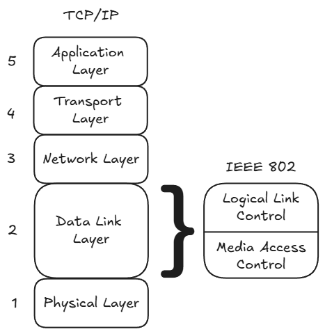

> **Context: Framing & Error Detection Mechanisms**
> * **Framing:** Groups bits into discrete blocks. Legacy systems used *byte-oriented* asynchronous framing (start bit, data bits, parity, stop bits). Modern protocols use *bit-oriented* synchronous framing (HDLC flags, control headers, and trailers).
> * **Error Detection:** Identifies transmission corruptions. *Parity bits* append 1 bit (detects only odd numbers of inverted bits). *Cyclic Redundancy Checks (CRC)* append polynomial check sequences (remainder of zero denotes an error-free frame). Corrupted frames detected by CRC are dropped or rejected, triggering ARQ.

---

### 1.2 Universal Timing Parameters
* **Frame Transmission Time ($T_{\text{frame}}$):** Time required to inject all bits of a frame onto the physical wire:
  $$T_{\text{frame}} = \frac{L}{R}$$
  * $L$ = Frame length (bits). *Note: Multiply bytes by 8.*
  * $R$ = Channel transmission rate (bits per second, bps).
* **Signal Propagation Delay ($T_{\text{prop}}$):** Time for a single bit to traverse the physical distance of the link:
  $$T_{\text{prop}} = \frac{D}{V}$$
  * $D$ = Physical link distance (meters).
  * $V$ = Signal propagation velocity in the medium (typically $2 \times 10^8\text{ m/s}$ in copper/fiber).
* **Processing Delay ($T_{\text{proc}}$):** Internal hardware/software processing time at endpoints.
* **Acknowledgment Transmission Time ($T_{\text{ack}}$):** Time required to emit the control ACK frame.
* **Total Cycle Time ($T_{\text{cycle}}$):** Total elapsed time from initial bit transmission until valid acknowledgment receipt:
  $$T_{\text{cycle}} = T_{\text{frame}} + T_{\text{prop}} + T_{\text{proc}} + T_{\text{ack}} + T_{\text{prop}} + T_{\text{proc}}$$

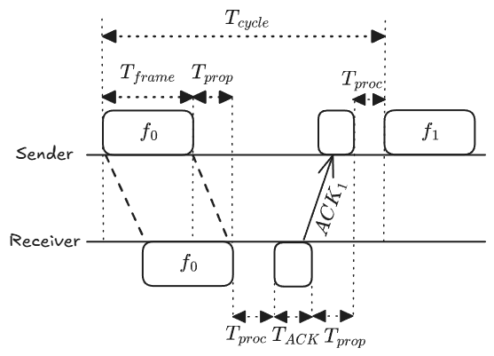

---

### 1.3 Link Utilization & Normalized Propagation Delay ($a$)
**Link Utilization ($U$):** Fraction of total cycle time spent actively carrying useful data bits:
$$U = \frac{T_{\text{frame}}}{T_{\text{cycle}}}$$

Under standard network course assumptions:
1. Saturated traffic source (sender always has queued frames to transmit).
2. Control frame transmission time and processing delays are negligible ($T_{\text{ack}} \approx 0, T_{\text{proc}} \approx 0$).

The cycle simplifies to:
$$T_{\text{cycle}} = T_{\text{frame}} + 2 T_{\text{prop}}$$

Substituting into $U$ gives:
$$U = \frac{T_{\text{frame}}}{T_{\text{frame}} + 2 T_{\text{prop}}} = \frac{1}{1 + 2\left(\frac{T_{\text{prop}}}{T_{\text{frame}}}\right)} = \frac{1}{1 + 2a}$$

where **Normalized Propagation Delay ($a$)** is defined as:
$$a = \frac{T_{\text{prop}}}{T_{\text{frame}}} = \frac{D \cdot R}{V \cdot L}$$

* **Physical Regimes of $a$:**
  * **$a < 1$ (Transmission Dominates):** Frame transmission delay exceeds propagation delay ($L/R > D/V$). Channel maintains high baseline efficiency.
  * **$a > 1$ (Propagation Dominates):** Signal flight time exceeds transmission time. The line sits idle for the majority of the cycle waiting for round-trip signal propagation. High bitrate or long distance causes utilization $U$ to drop sharply toward zero.

---

## 2. Stop-and-Wait Protocol Family

### 2.1 Flow Control (Error-Free)
* **Core Rule:** The transmitter emits 1 frame and halts until an explicit acknowledgment ($\text{ACK}$) is returned by the receiver before emitting the next frame.
* **1-Bit Alternating Sequence Numbers:**
  * Frames alternate with binary sequence labels: $f_0$ and $f_1$.
  * Acknowledgment label $\text{ACK}_n$ indicates that the receiver has successfully processed frame $f_{1-n}$ and is actively waiting for frame $f_n$ (e.g., $\text{ACK}_1$ confirms $f_0$ and requests $f_1$).
* **Link Utilization:**
  $$U_{\text{SaW}} = \frac{1}{1 + 2a}$$

---

### 2.2 Error Control: Stop-and-Wait ARQ
Extends Stop-and-Wait flow control to recover from transmission faults:
* **Lost Frame:** Receiver never receives frame. Sender retransmission timer expires ($T_{\text{timeout}} > T_{\text{frame}} + 2T_{\text{prop}}$), prompting retransmission of the original frame.
* **Damaged Frame:** Receiver detects corrupted bits via CRC and either drops the frame silently (triggering sender timeout) or returns an explicit Negative Acknowledgment ($\text{NAK}$).
* **Lost ACK (Duplicate Handling):** If an ACK is lost on the return path, the sender times out and re-emits the previous data frame. The receiver identifies the frame sequence number as a duplicate, discards the redundant payload, and re-transmits the matching ACK to keep the sender synchronized.
* **Link Utilization with Independent Frame Loss Probability ($P$):**
  $$U_{\text{SaW}}^{\text{ARQ}} = \frac{1 - P}{1 + 2a}$$

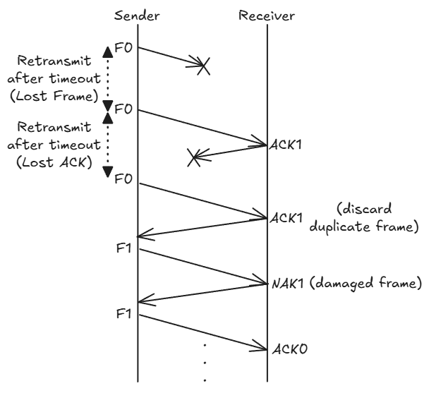

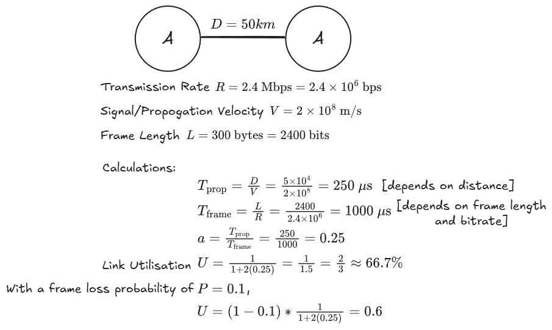

---

## 3. Sliding Window Protocol Family

### 3.1 Flow Control & Window Architecture
Sliding window protocols overcome the propagation idle delay of Stop-and-Wait by permitting multiple frames to remain unacknowledged in transit simultaneously.

* **Sequence Number Space ($k$ bits):** Frames are indexed modulo $2^k$, cycling through integers in the discrete range $[0, 2^k - 1]$.
* **Cumulative Acknowledgments:** An $\text{ACK}(n)$ (or Receive Ready, $\text{RR}(n)$) acknowledges all frames up to $n - 1$ and requests frame $n$.
* **Flow Throttling (RNR):** A Receive Not Ready ($\text{RNR}(n)$) acknowledges frames up to $n - 1$ while closing the transmission window, halting further transmissions until an explicit $\text{RR}$ is sent.
* **Piggybacking:** In full-duplex links, reverse-direction acknowledgment numbers are embedded directly into outgoing data frame headers.

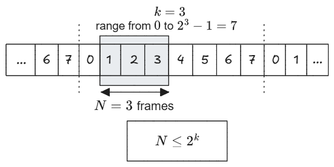

---

### 3.2 Window Edge Shifting Invariants
The transmission and reception windows govern which sequence numbers are valid:

* **Sender Window ($W_{\text{tx}}$):**
  * **Trailing Edge (Lower Bound / Left):** Moves forward (window shrinks) when frames are **sent**.
  * **Leading Edge (Upper Bound / Right):** Moves forward (window expands) when valid **ACKs are received**.
* **Receiver Window ($W_{\text{rx}}$):**
  * **Trailing Edge (Lower Bound / Left):** Moves forward (window shrinks) when in-order frames are **received**.
  * **Leading Edge (Upper Bound / Right):** Moves forward (window expands) when valid **ACKs are sent**.

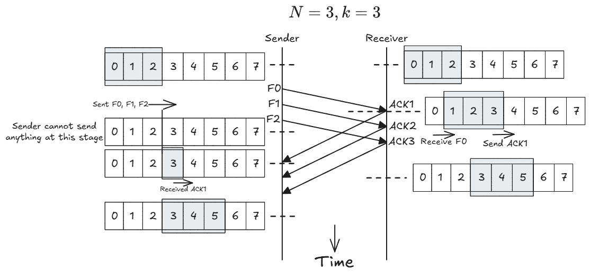

---

### 3.3 Theoretical Window Bound (Error-Free Flow Control)
For error-free sliding window flow control with a $k$-bit sequence field:
$$N \le 2^k$$

* **Failure Condition ($N > 2^k$):** If the window size exceeds the sequence numbering capacity, sequence numbers overlap within the active window, making it impossible to identify whether an incoming acknowledgment applies to the current frame or a wrapped cycle frame.

---

### 3.4 Error-Free Link Utilization ($U$)
Normalizing frame transmission time to $T_{\text{frame}} = 1$ (meaning full cycle duration is $1 + 2a$):

* **Case I: Full Pipe ($N \ge 1 + 2a$)**
  * Window size is large enough to allow continuous transmission until the first acknowledgment returns at $t = 1 + 2a$.
  * Transmission line experiences zero idle time:
    $$U = 1.0 \quad (100\%)$$

* **Case II: Window Exhaustion ($N < 1 + 2a$)**
  * Sender exhausts its window capacity of $N$ frames at $t = N$ and is forced to wait idle until $t = 1 + 2a$ for the first ACK to arrive.
  * Line utilization is bounded by the unacknowledged frame capacity:
    $$U = \frac{N}{1 + 2a}$$

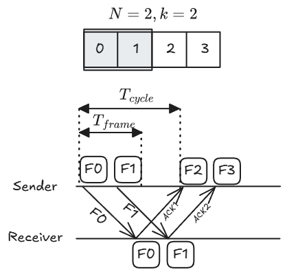

* **Impact of Parameter $a$ Across Window Sizes:**
  * For any fixed window size $N$, as the normalized propagation delay $a$ increases, link utilization $U$ drops sharply toward zero.
  * Increasing window size $N$ shifts the curve to the right, maintaining $U = 1.0$ across higher speeds or longer physical distances before performance begins to degrade.

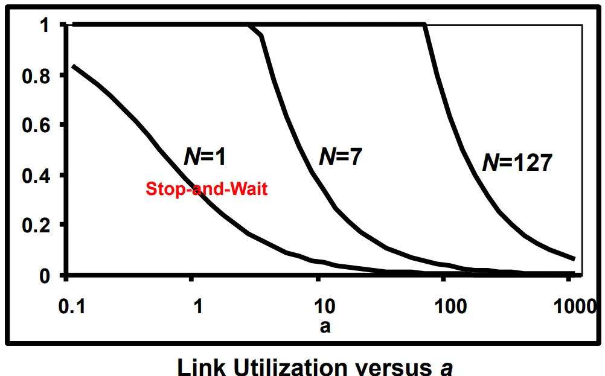

---

## 4. Sliding Window Error Control: Go-Back-N ARQ (GBN)

### 4.1 Mechanics & Buffer Configuration
* **Receiver Window ($W_{\text{rx}} = 1$):** Receiver accepts frames strictly in contiguous order and possesses zero out-of-order buffering capacity.
* **Sender Window ($W_{\text{tx}} = N$):** Sender can buffer up to $N$ unacknowledged transmitted frames.
* **Recovery Behavior:**
  * If a frame is corrupted or lost, the receiver rejects it and all subsequent out-of-order frames by sending $\text{REJ}(n)$ / $\text{NAK}(n)$.
  * Upon timeout or receipt of $\text{NAK}(n)$, the sender rewinds its window back to $n$ and retransmits frame $n$ along with every subsequent frame previously transmitted.

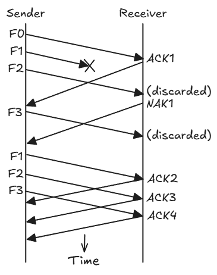

---

### 4.2 Maximum Window Size Derivation for GBN
Applying the non-overlap invariant with a 1-slot receiver window ($W_{\text{tx}} = N$, $W_{\text{rx}} = 1$):
$$W_{\text{tx}} + W_{\text{rx}} \le 2^k \implies N + 1 \le 2^k \implies N \le 2^k - 1$$

* **Failure Scenario at $N = 2^k$ (e.g., $k = 3 \implies N = 8$):**
  1. Sender transmits an entire window of 8 frames: $0, 1, 2, 3, 4, 5, 6, 7$.
  2. Receiver receives all 8 frames in order, advances its expected sequence pointer to $0$, and transmits $\text{ACK } 0$.
  3. All return ACKs are completely lost in transit.
  4. Sender times out and re-emits old frame $0$.
  5. The receiver, expecting new frame $0$, cannot distinguish the old duplicate frame $0$ from a brand new frame $0$, accepting duplicate data.

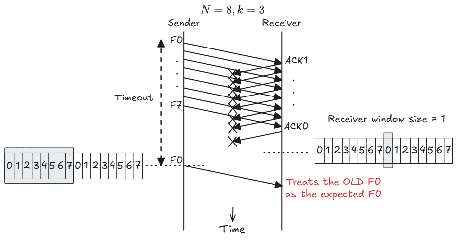

* **Resolution at $N = 2^k - 1$ (e.g., $k = 3 \implies N = 7$):**
  * If all ACKs for window frames $0$ through $6$ are lost, the receiver advances its expected sequence pointer to $7$.
  * Sender times out and retransmits old frame $0$.
  * Frame $0 \neq 7$; the receiver identifies it as an out-of-window duplicate, discards it, and re-sends $\text{ACK } 7$.

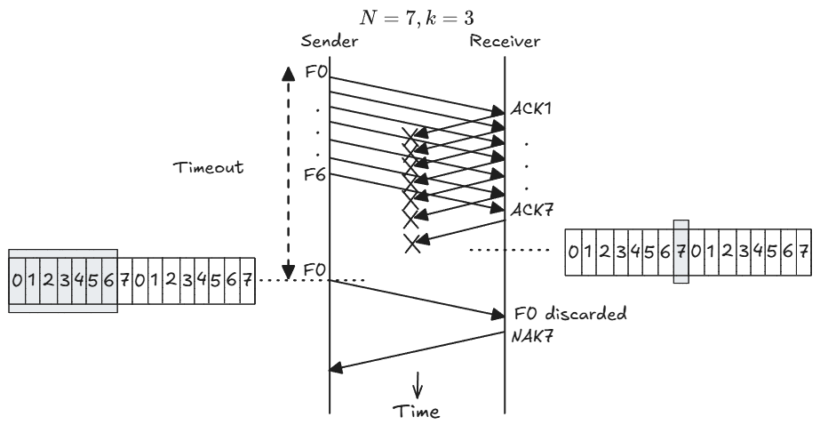

---

## 5. Sliding Window Error Control: Selective Reject ARQ (SR)

### 5.1 Mechanics & Buffer Configuration
* **Receiver Window ($W_{\text{rx}} = N$):** Receiver maintains an out-of-order buffer of size $N$.
* **Sender Window ($W_{\text{tx}} = N$):** Sender maintains an unacknowledged buffer of size $N$.
* **Recovery Behavior:**
  * If frame $n$ is missing or corrupted, the receiver issues $\text{SREJ}(n)$ / $\text{NAK}(n)$.
  * Subsequent valid out-of-order frames that fall inside the open receive window are accepted and buffered.
  * Sender retransmits **only** the single missing frame $n$.
  * Once missing frame $n$ arrives correctly, the receiver orders the buffered frames and delivers the contiguous block to the network layer.

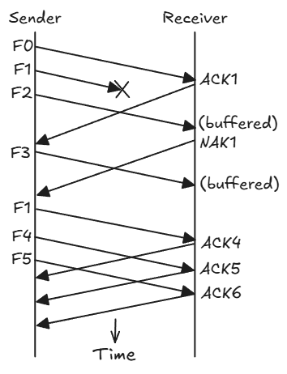

---

### 5.2 Maximum Window Size Derivation for SR
Because both the sender and receiver maintain active sliding windows of size $N$:
$$W_{\text{tx}} + W_{\text{rx}} \le 2^k \implies 2N \le 2^k \implies N \le 2^{k-1}$$

* **Failure Scenario at $N > 2^{k-1}$ (e.g., $k = 3 \implies N = 5$):**
  1. Sender emits frames $0, 1, 2, 3, 4$.
  2. Receiver accepts all 5 frames and advances its receive window to $[5, 6, 7, 0, 1]$.
  3. All returning ACKs are lost.
  4. Sender times out and re-emits old frame $0$.
  5. Old frame $0$ falls directly inside the receiver's open window range $[5, 6, 7, 0, 1]$ and is accepted as new frame $0$.

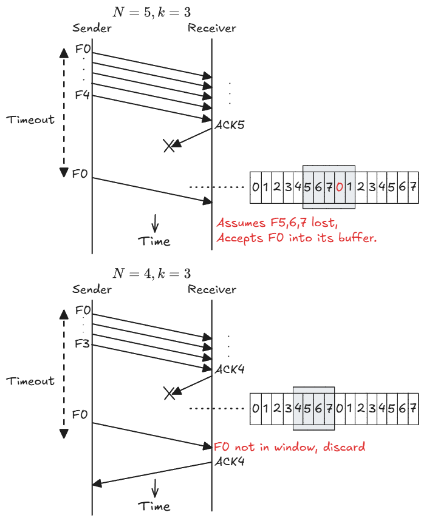

* **Resolution at $N = 2^{k-1}$ (e.g., $k = 3 \implies N = 4$):**
  * When frames $0$ through $3$ are accepted, the receive window shifts forward to $[4, 5, 6, 7]$.
  * Sender times out and retransmits old frame $0$.
  * Old frame $0$ falls strictly outside $[4, 5, 6, 7]$; the receiver drops it and re-issues $\text{ACK } 4$.

---

## 6. Master Summary & Examination Formulas

### 6.1 Structural Comparison Matrix

| Protocol Feature | Stop-and-Wait ARQ | Go-Back-N ARQ (GBN) | Selective Reject ARQ (SR) |
| :--- | :--- | :--- | :--- |
| **Sender Window Size ($W_{\text{tx}}$)** | $1$ | $N \le 2^k - 1$ | $N \le 2^{k-1}$ |
| **Receiver Window Size ($W_{\text{rx}}$)** | $1$ | $1$ (in-order delivery only) | $N$ (out-of-order buffering) |
| **Retransmission Scope** | Current frame only | Corrupted frame **and all subsequent** frames | Corrupted frame **only** |
| **Buffer Complexity** | Minimal (1 frame) | Low (Sender buffers $N$, Receiver buffers 1) | High (Sender and Receiver both buffer $N$) |
| **Bandwidth Efficiency** | Low under $a \gg 1$ | Moderate (wasted by redundant retransmissions) | Highest (transmits only lost packets) |

---

### 6.2 Exam Formula Reference Sheet

* **Stop-and-Wait Flow Control (Error-Free):**
  $$U = \frac{1}{1 + 2a}$$

* **Stop-and-Wait ARQ (Frame Loss Probability $P$):**
  $$U_{\text{SaW}}^{\text{ARQ}} = \frac{1 - P}{1 + 2a}$$

* **Sliding Window Flow Control (Error-Free):**
  $$U = \begin{cases} 1 & N \ge 1 + 2a \\ \dfrac{N}{1 + 2a} & N < 1 + 2a \end{cases}$$

* **Selective Reject ARQ (Frame Loss Probability $P$):**
  $$U_{\text{SR}} = \begin{cases} 1 - P & N \ge 1 + 2a \\[0.8em] \dfrac{N(1 - P)}{1 + 2a} & N < 1 + 2a \end{cases}$$

* **Go-Back-N ARQ Calculation Convention:**
  $$\text{For course examinations: Use the Selective Reject formula above to calculate } U_{\text{GBN}}.$$
