# Data Link Layer (DLL): Medium Access Control & LANs

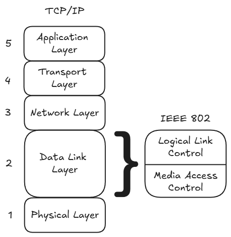

Recall that DLL is split into LLC (Layer 2 top) and MAC (Layer 2 bottom). 
Previously we looked at LLC (flow and error control over a logical link).
Now we look at MAC (channel arbitration and framing over shared LAN media).

## [Non-examinable] LAN & MAC Architecture

* **Local Area Network (LAN):** Owner-operated network spanning a small localized area (a few km; home, office, campus) without leased lines. Consists of a shared medium, access regulations, and interfacing hardware/software.
* **Topologies:**
  * *Bus & Tree:* Multipoint broadcast medium terminated with resistors to absorb reflections. Transmits in frames to prevent medium monopolization.
  * *Ring:* Closed loop of unidirectional point-to-point repeater links. Frames circulate past all nodes, get copied by the destination, and are stripped by the sender. MAC governs frame insertion.
  * *Star:* Stations link point-to-point to a central node. Acts like a logical bus if using a broadcast hub (collisions possible), or isolated collision-free links if using a switch.

* **MAC Sublayer Functions:**
  * *Framing:* Frame assembly/disassembly with address and CRC error detection fields.
  * *Addressing:* Destination address recognition on shared media.
  * *Medium Access Control:* Governs *when* a station can transmit to manage shared channel access.
  * *Decoupling:* Multiple physical/MAC standards (Ethernet, Wi-Fi) interface beneath the same LLC.

* **MAC Decision Options:**
  * *Where:* **Centralized** (simple station logic, tight control; single point of failure, bottleneck) vs. **Distributed** (stations coordinate access cooperatively).
  * *How:*
    * **Static (TDM / FDM):** Fixed slots/frequencies. Wastes bandwidth and increases delay if traffic is bursty.
    * **Dynamic - Controlled (Round Robin / Polling / Reservation):** Stations take turns or reserve slots. Efficient for heavy/stream traffic; high turn-passing overhead when idle.
    * **Dynamic - Contention (Random Access):** Stations transmit on demand without central control, risking collisions. Ideal for bursty traffic under light/moderate load; degrades under heavy load due to excessive collisions.

## MAC Protocols
The MAC problem:

- A single shared broadcast channel is utilized by multiple transmitting nodes.
- A collision occurs whenever two or more nodes transmit simultaneously, causing a receiving node to hear corrupted overlapping signals.
- A MAC protocol is a distributed algorithm that dictates how nodes share channel capacity.
- Crucially, coordination about channel sharing must use the channel itself; there is no out-of-band communication channel available for control signaling.

An ideal (genie-aided) MAC protocol: For a broadcast channel operating at a transmission rate of $R\text{ bps}$:

- High Throughput & Proportional Fairness:
  - Only $1$ node wants to transmit: sends at the full rate $R$.
  - $M$ nodes want to transmit simultaneously, each sends at average rate of $\frac{R}{M}$.
- Fully decentralised:
  - No master/special node exists to coordinate transmissions (no single point of failure).
  - No synchronization of node clocks or time slots is required.
- Simple:
  - Minimal implementation and computational overhead.

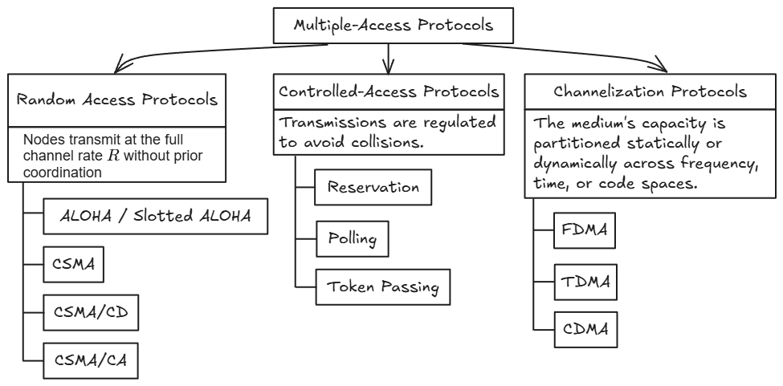

## Random Access Protocols (ALOHA & CSMA)
- Nodes transmit at the full channel rate $R$ without prior coordination.
- Collisions can happen and are resolved dynamically.

The 3 core design aspects of Random Access Protocols:

1. Whether to sense the channel status before sending (e.g., blind transmission in ALOHA vs. carrier sensing in CSMA).
2. How to transmit frames once ready or once the channel becomes free (e.g., immediate transmission vs. persistent/probabilistic deferred sending).
3. How to detect and react to collisions (e.g., abort immediately and back off in CSMA/CD vs. waiting for an upper-layer ACK timeout).  

### Slotted ALOHA

* **Core Assumptions:**
  * Fixed frame sizes; time partitioned into synchronized discrete slots ($T_{slot} = T_{frame}$).
  * Nodes transmit only at slot boundaries.
  * Collisions occur if $\ge 2$ nodes transmit in the same slot. All nodes detect the collision, discard the corrupted data, and re-attempt transmission in subsequent slots with probability $p$ until successful.

<!-- Slotted ALOHA timeline diagram ? -->
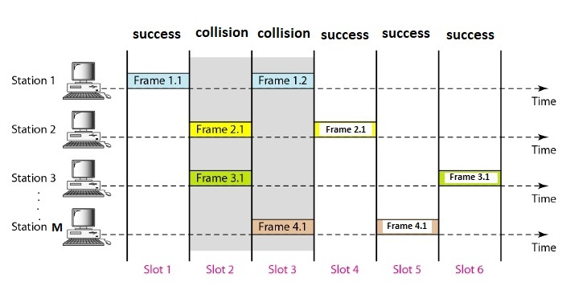

* **Slot Probability Derivation:**
  * For $N$ independent nodes each transmitting with probability $p$:
    * Single node $i$ succeeds: $Pr(S_i) = p(1 - p)^{N-1}$
    * Any successful transmission in a slot:
      $$Pr(S) = \sum_{i=1}^{N} Pr(S_i) = Np(1 - p)^{N-1}$$

* **Offered Load ($G$) & Large $N$ Limit:**
  * **Offered Load ($G = Np$):** Expected total transmission attempts generated by the entire network per slot.
  * Substituting $p = \frac{G}{N}$ as $N \to \infty$ ($p \to 0$):
    $$S = \lim_{N \to \infty} N\left(\frac{G}{N}\right)\left(1 - \frac{G}{N}\right)^{N-1} = G e^{-G}$$

  * Maximum Throughput Derivation:
    * Maximize $S(G)$ by setting derivative to zero:
      $$\frac{dS}{dG} = e^{-G}(1 - G) = 0 \implies G^* = 1.0$$

    * Peak throughput at $G = 1$:
      $$S_{max} = 1 \cdot e^{-1} = \frac{1}{e} \approx 0.368 \quad (36.8\%)$$

    * Interpretation of $G = 1$: 
      * The network achieves peak throughput when, on average, the network generates **exactly 1 transmission attempt per slot**.
      * If $G < 1$, the channel is under-utilized (dominated by idle, empty slots).
      * If $G > 1$, nodes attempt too aggressively, causing throughput to plummet due to destructive collisions.
    * State distribution at peak ($G = 1$):
      * $Pr(\text{Successful}) = 1/e \approx 36.8\%$
      * $Pr(\text{Empty}) = e^{-1} \approx 36.8\%$
      * $Pr(\text{Collision}) = 1 - 2e^{-1} \approx 26.4\%$

* Trade-offs:
  * Pros:
    * Extremely simple logic.
    * Highly decentralized; only slot boundaries require synchronization.
    * A single active node can transmit at full rate $R$ if no competition.
  * Cons:
    * $\approx 63\%$ capacity wasted (collisions + empty slots) at maximum achievable throughput point ($G=1$)
    * Requires global clock synchronization.

### Pure (Unslotted) ALOHA
* **Core Assumptions & Mechanics:**
  * Continuous time; no slotting or global clock synchronization.
  * Uniform Frame Length: All frames are assumed to have the exact same duration $T$.
  * Stations transmit immediately whenever data arrives, without sensing the channel.
  * Any partial overlap (even 1 bit) causes a collision, corrupting all overlapping frames.

* **Vulnerable Window Derivation ($2T$):**
  * Target frame starts at $t_0$ and ends at $t_0 + T$.
  * Because all frames have duration $T$:
    * A frame starting in $(t_0 - T, t_0)$ collides with the target's start.
    * A frame starting in $[t_0, t_0 + T)$ collides with the target's end.
  * **Total Vulnerable Interval:** $(t_0 - T, t_0 + T)$, with a duration of $2T$.

<!-- Pure ALOHA timeline diagram -->
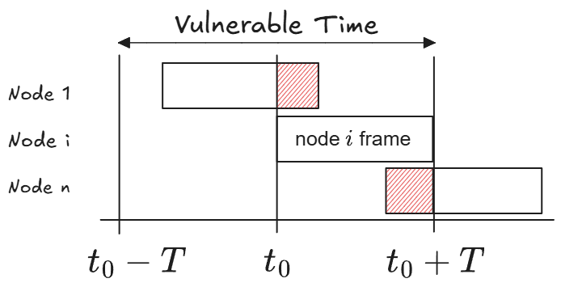

* **Throughput Derivation ($S$):**
  * Frame attempts follow a Poisson process with average offered rate $G$ attempts per frame time $T$.
  * Expected arrivals in vulnerable window $2T$ is $2G$.
  * Probability of zero interfering transmissions:
    $$Pr(\text{No collision}) = P(k = 0) = \frac{(2G)^0 e^{-2G}}{0!} = e^{-2G}$$

  * Channel throughput:
    $$S = G e^{-2G}$$

  * **Maximum Throughput & Operating Point ($G = 0.5$):**
    * Differentiating with respect to $G$:
      $$\frac{dS}{dG} = e^{-2G}(1 - 2G) = 0 \implies G^* = 0.5$$

    * **Physical Interpretation:** Peak throughput requires the network to generate an average of **1 attempt every 2 frame times** ($G = 0.5$).
    * Maximum achievable throughput:
      $$S_{max} = 0.5 \cdot e^{-1} = \frac{1}{2e} \approx 0.184 \quad (18.4\%)$$

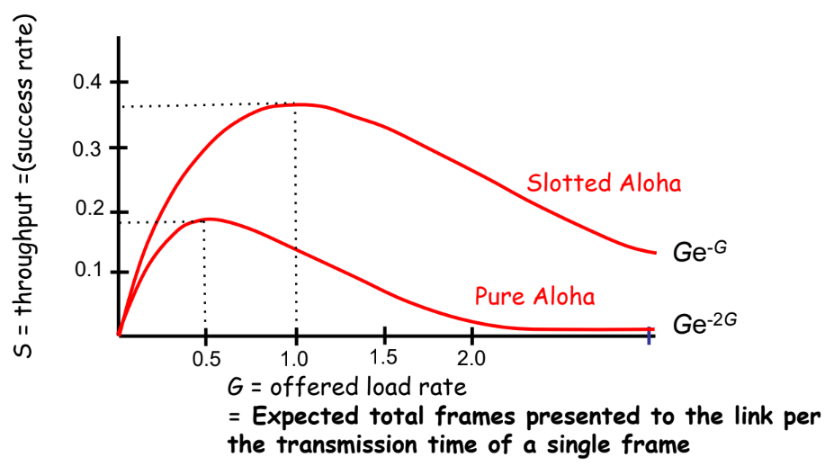

* **Slotted vs. Pure ALOHA:**
  * Pure ALOHA's arbitrary start times double the vulnerable window ($2T$ vs. $1T$).
  * Slotted ALOHA halves the vulnerable period via slot synchronization, exactly doubling maximum efficiency from $18.4\%$ to $36.8\%$.

* **What Happens During a Collision:**
  * Senders cannot detect collisions while transmitting.
  * Colliding frames arrive garbled at the receiver, fail the CRC error check, and are silently thrown away without returning an ACK.
  * The sender only realizes the frame was lost when its ACK timeout expires.
  * Once the timer times out, the sender waits a random backoff time before trying again to avoid colliding in lockstep.

### Carrier Sense Multiple Access (CSMA)
* **Core Principle:** "Listen before transmit" (LBT).
  * *Channel Idle:* Transmit frame.
  * *Channel Busy:* Defer transmission to avoid collisions.

* **Why Collisions Still Occur (Vulnerable Period = $\tau$):**
  * Electromagnetic signals propagate at a finite speed.
  * Let $\tau$ denote the maximum end-to-end propagation delay between the two farthest nodes.
  * If node A begins sending at $t_0$, node B cannot detect the carrier until $t_0 + \tau$. If B senses the medium before $t_0 + \tau$, it sees an idle channel and transmits, triggering a collision.
  * **Vulnerable Window:** $\tau$ . This is orders of magnitude smaller than ALOHA's $T_{frame}$ or $2T_{frame}$.

* **What Happens During a Collision:**
  * Senders cannot sense collisions once sending starts.
  * If two nodes begin transmitting within the propagation delay window ($\tau$), their signals collide. Neither node notices, so both blast their entire corrupted frames to the end, wasting channel time.
  * Receivers discard the corrupted frames.
  * Senders are unaware of the loss until a slow upper-layer protocol timer (like TCP) times out.
  * *Motivation for CSMA/CD:* This channel waste directly motivated adding active collision detection hardware so nodes can abort immediately upon a collision.

#### CSMA Persistence Variants

Governs how a station reacts when it has data ready to transmit:

| Strategy | When Channel is Idle | When Channel is Busy | Trade-off / Characteristic |
| :--- | :--- | :--- | :--- |
| **1-Persistent** | Transmits immediately with probability $p = 1$. | Continues sensing until channel clears, then transmits immediately ($p = 1$). | **Minimizes idle delay** when load is light. **Guarantees collisions** if $\ge 2$ stations defer during an ongoing packet. |
| **Non-Persistent** | Transmits immediately. | Abandons continuous sensing, waits a random backoff interval, then senses again. | **Reduces collisions** under medium/heavy load by scattering attempts. **Wastes channel time** waiting out backoffs when channel is actually idle. |
| **$p$-Persistent** *(Slotted)* | Transmits with probability $p$; defers to the next slot with probability $1 - p$. | Waits for current transmission to finish, then applies the probabilistic slot rule. | **Balances idle waste vs. collision rate** via parameter $p$. As $p \to 1$, behaves like 1-persistent; as $p \to 0$, idle latency spikes. |

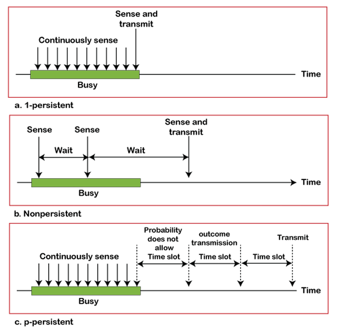

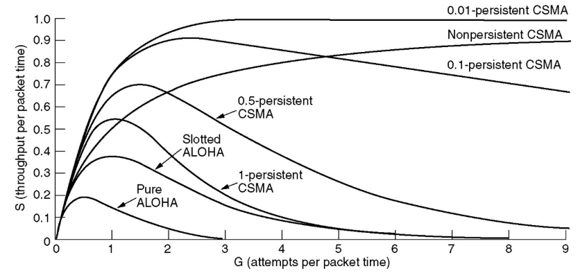

**Throughput ($S$) vs. Offered Load ($G$) Interpretation**

* **ALOHA vs. CSMA:**
  * ALOHA transmits blindly, collapsing early (Pure peaks at $S \approx 0.184$ at $G = 0.5$; Slotted peaks at $S \approx 0.368$ at $G = 1.0$).
  * CSMA shrinks the vulnerable window from frame duration ($T$) to propagation delay ($\tau$), dramatically outperforming ALOHA across all loads.

* **1-Persistent CSMA:**
  * Best for very light load ($G < 1$); zero artificial delay.
  * Collapses sharply under heavy load because queued nodes transmit simultaneously ($p = 1$) the moment the channel clears, guaranteeing collisions.

* **Non-Persistent CSMA:**
  * Slower initial rise due to artificial backoff delays.
  * Plateaus and remains stable at high loads ($S \approx 0.8\text{--}0.9$) without collapsing, because random backoffs desynchronize retry attempts.

* **$p$-Persistent CSMA ($p = 0.5, 0.1, 0.01$):**
  * Lower $p$ yields higher peak throughput (up to $\approx 1.0$ for $p = 0.01$ under heavy load) by drastically suppressing simultaneous attempts.
  * *Latency Penalty:* Very small $p$ causes excessive idle slot delays under light-to-moderate loads as nodes repeatedly defer transmission over an empty medium.

### CSMA with Collision Detection (CSMA/CD)
* **Motivation:**
  * In pure CSMA, colliding stations transmit full corrupted frames, wasting significant channel bandwidth.
  * CSMA/CD enforces "listen while talk": nodes monitor the medium during transmission and abort immediately upon detecting a collision.
  * Widely used in shared-medium, bus-topology LANs (IEEE 802.3 Ethernet).

* **Collision Detection Hardware Mechanisms:**
  * **Station Transceiver (Network Interface Card):** Hardware attached to the cable tap. Compares observed channel signal power/voltage against its own transmitted power. An unexpected increase in energy confirms overlapping signals (a collision).
  * **Repeating Hub (Star Topology):** Central Layer 1 multiport device. If signals arrive simultaneously on two input ports, the hub flags a collision and broadcasts a "collision presence" signal out of all ports.

* **Worst-Case Collision Detection Time Window ($2a$):**
  * Let $a$ denote the maximum one-way propagation delay between the two most distant stations (A and B).
  * **Scenario:**
    1. $t = T_0$: Station A begins transmitting on an idle channel.
    2. $t = T_0 + a - \epsilon$: Just before A's signal reaches B, Station B senses idle and transmits.
    3. $t = T_0 + a$: Collision occurs near B; B detects it immediately.
    4. $t \approx T_0 + 2a$: Corrupted collision wavefront travels back across the medium to A; A finally detects the collision.
  * **Takeaway:** In the worst case, detecting a collision takes **twice the maximum propagation delay ($2a$)**.
  * The longer the propagation delay, the worse the performance of the protocol.

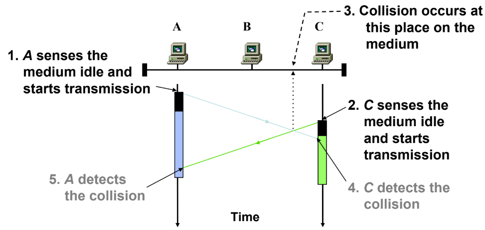

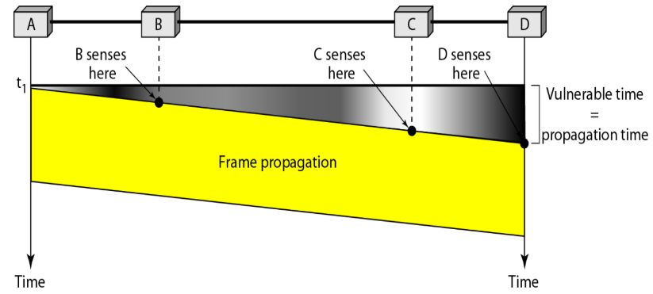

* **Transmission & Collision Protocol Flow:**
  * **Carrier Sense:** Use a CSMA persistence strategy (e.g., 1-persistent in Ethernet) to sense and access an idle channel.
  * **Listen While Sending:** Continually monitor physical channel energy during data transmission.
  * **Collision Handling:**
    * *Abort Immediately:* Halt data frame transmission to minimize channel wastage.
    * *Send Jam Signal (48 bits):* The transmitting station that detects the collision immediately sends a 48-bit jam signal. This amplifies and prolongs the collision waveform so all other stations on the cable detect it and discard corrupted frame fragments.
    * *Backoff & Retransmit:* Enter random backoff before re-sensing the medium to retry.

## Wired LAN: Ethernet

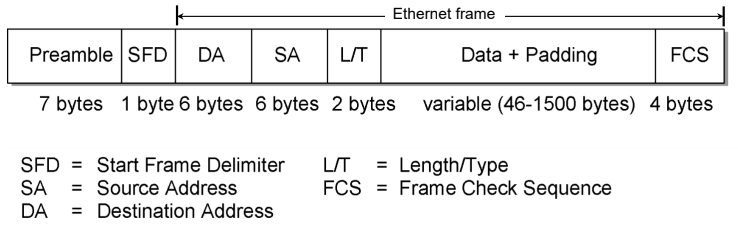

* **Frame Field Breakdown:**
  * **Preamble (7 bytes):** 7 $\times$ 8 bits (`10101010`) to synchronize the receiver's clock.
  * **Start Frame Delimiter (SFD, 1 byte):** Pattern `10101011` signaling the start of valid frame data.
  * **Destination Address (DA, 6 bytes / 48 bits):** Hardware MAC address of the target adapter.
  * **Source Address (SA, 6 bytes / 48 bits):** Hardware MAC address of the transmitting adapter.
  * **Length / Type (L/T, 2 bytes):** Demultiplexing key indicating the higher-layer protocol (e.g., IPv4, ARP).
  * **Data + Padding (46 to 1500 bytes):**
    * Maximum Transmission Unit (MTU) data payload is 1500 bytes.
    * Minimum data payload is **46 bytes**. If actual data $<$ 46 bytes, dummy padding is appended to satisfy the minimum frame size requirement.
  * **Frame Check Sequence (FCS, 4 bytes):** 32-bit CRC for error detection, computed over the Destination Address through the Padding fields.

### MAC Addressing & Frame Types

Every network interface adapter has a unique **48-bit (6-byte)** physical address, formatted as 6 hexadecimal octets: `XX:XX:XX:XX:XX:XX`.

* *Hex Recall:* Each hex digit represents **4 bits** (one nibble). Thus, two hex digits make up **1 byte** (8 bits).
* *Context:* Classification applies to the **Destination Address (DA)** to determine how nodes process the incoming frame. (The Source Address (SA) is always a unique unicast hardware address).
* *More context (Layer 2 vs. Layer 3):*
  * **IP Address (Logical / Global):** Routes packets end-to-end across the Internet from original sender to final destination.
  * **MAC Address (Physical / Local):** Delivers frames hop-by-hop strictly within the current local network (LAN).
  * *Router Hop Boundary:* MAC addresses never cross a router. When a router forwards a packet to another network, it strips the old Layer 2 header and encapsulates the packet in a new Layer 2 frame with fresh MAC addresses for the next local hop.

* **The 3 Frame Delivery Types:**
  * **Unicast (One-to-One):** Targeted to a single recipient network adapter.
  * **Multicast (One-to-Many):** Targeted to a group of subscribed devices.
  * **Broadcast (One-to-All):** Delivered to all hosts on the local network.

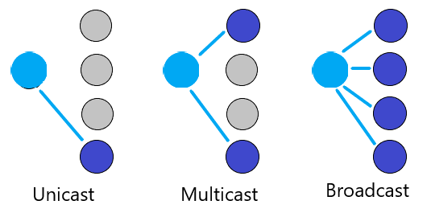{width=60%}

* **Classification Rule (Examine the 1st Byte / 2nd Hex Digit from Left):**
  * Ethernet transmits the least significant bit (LSB) of each byte first onto the physical wire. IEEE standards designate this very first transmitted bit (bit 0 of byte 1) as the Unicast/Multicast flag:
    * LSB is `0` $\implies$ **Unicast** (the 2nd hex digit ends in `0` and is **even**: `0, 2, 4, 6, 8, A, C, E`).
    * LSB is `1` $\implies$ **Multicast** (the 2nd hex digit ends in `1` and is **odd**: `1, 3, 5, 7, 9, B, D, F`).
    * All 48 bits are `1`s $\implies$ **Broadcast** (`FF:FF:FF:FF:FF:FF`).

* **Examples:**
  * `4A:30:10:21:10:1A` $\to$ 2nd digit is `A` ($1010_2$, ends in `0`, even) $\implies$ **Unicast**.
  * `47:20:1B:2E:08:EE` $\to$ 2nd digit is `7` ($0111_2$, ends in `1`, odd) $\implies$ **Multicast**.
  * `FF:FF:FF:FF:FF:FF` $\to$ All digits are `F` $\implies$ **Broadcast**.

### Ethernet MAC Protocol & Minimum Frame Size

* **Carrier Sense & Transmission Rules:**
  * Uses **1-persistent CSMA/CD**.
  * If channel is busy, continuously listens and transmits immediately when it turns idle.
  * Enforces an inter-frame gap of $9.6\ \mu\text{s}$ between back-to-back frames.
  * Maximum payload data size (MTU) is bounded at 1500 bytes.

* **The key requirement: Keep transmitting while collision signal returns:**
  * In CSMA/CD, transceivers only monitor for collisions while actively transmitting.
  * If a frame finishes sending before the collision echo returns, the sender marks the transmission successful, clears its buffer, and will never retransmit at Layer 2 (leaving recovery to slow transport timeouts).
  * In the worst case, a collision occurring near the farthest station at time $\tau$ requires another $\tau$ to propagate back to the sender ($2\tau$ round-trip time).
  * Therefore, the frame transmission duration must satisfy:
    $$T_{\text{frame}} \ge 2\tau$$

* **Derivation of the 64-Byte Minimum Frame Size & 46-Byte Payload:**
  * **Worst-Case RTT ($2\tau$):** For a standard 2500 m maximum Ethernet network span, IEEE 802.3 defines the slot time:
    $$2\tau = 51.2\ \mu\text{s}$$

  * **Bit Transmission Time at 10 Mbps:**
    $$\frac{1}{10 \times 10^6\text{ bps}} = 0.1\ \mu\text{s/bit}$$

  * **Minimum Frame Length ($L_{\min}$):**
    $$L_{\min} = \frac{51.2\ \mu\text{s}}{0.1\ \mu\text{s/bit}} = 512\text{ bits} = \mathbf{64\text{ bytes}}$$

  * **Note: Exclusion of Preamble & SFD:**
    * Preamble (7 bytes) and SFD (1 byte) are physical-layer synchronization preambles stripped by the receiving NIC.
    * The IEEE 802.3 **MAC frame** strictly spans from Destination Address (DA) to Frame Check Sequence (FCS).
  * **Mandatory Header & Trailer Overhead:**
    $$\text{DA (6B)} + \text{SA (6B)} + \text{Length/Type (2B)} + \text{CRC FCS (4B)} = \mathbf{18\text{ bytes}}$$

  * **Derivation of 46-Byte Minimum Data:**
    $$\text{Minimum Data Payload} = 64\text{ bytes} - 18\text{ bytes} = \mathbf{46\text{ bytes}}$$
    *(If upper-layer payload $< 46\text{ bytes}$, dummy **Padding** bytes are appended to guarantee the MAC frame reaches at least 64 bytes).*

* **Jam Signal (48 bits):**
  * Transmitted immediately upon detecting a collision to prolong the illegal electrical disturbance on the wire.
  * Guarantees that even distant nodes with brief collision overlaps reliably detect the collision and discard corrupted frame fragments.

---

### Binary Exponential Backoff (BEB) Algorithm

* **Purpose:** Stops stations from colliding again at the same time by making each station wait a random amount of time, with the wait range doubling after each collision.

* **Slot Unit:** Measured in multiples of slot time ($51.2\ \mu\text{s}$).

* **Algorithm Steps for $i$-th Collision:**
  1. Calculate exponent bound:
     $$k = \min(i, 10)$$

  2. Select an integer $K$ uniformly at random from the range:
     $$K \in \{0, 1, \ldots, 2^k - 1\}$$

  3. Wait for delay interval:
     $$\text{Delay} = K \times 51.2\ \mu\text{s}$$

  4. Re-sense the medium and attempt retransmission.

* **Limits:**
  * **Window Cap:** Backoff window expands up to $i = 10$, capping at $K \in [0, 1023]$ ($2^{10} - 1$).
  * **Abort Threshold:** If collisions persist up to 16 attempts (`attempts == 16`), the adapter abandons retransmission, discards the packet, and alerts higher-layer software.

* **Example: collision probability for 2 stations (A and B):**
  * **1st Retrial ($i = 1$):**
    * $K \in \{0, 1\}$, with probability $0.5$ each.
    * $P(\text{Collision}) = P(A=0, B=0) + P(A=1, B=1) = (0.5 \times 0.5) + (0.5 \times 0.5) = 0.25 + 0.25 = \mathbf{0.5}$ ($50\%$).
  * **2nd Retrial ($i = 2$):**
    * $K \in \{0, 1, 2, 3\}$, with probability $0.25$ each.
    * $P(\text{Collision}) = \sum_{j=0}^{3} P(A=j, B=j) = 4 \times (0.25 \times 0.25) = 4 \times 0.0625 = \mathbf{0.25}$ ($25\%$).
  * **General Formulas ($W = 2^k$):**
    * For 2 stations picking independently from window $W$:
      $$P(\text{Collision}) = \frac{1}{W} = \frac{1}{2^k}$$

    * For $N$ stations, probability that a specific slot has no collision:
      $$P(\text{No Collision}) = N \times \frac{1}{W}\left(1 - \frac{1}{W}\right)^{N-1}$$

### Hardware Devices (Layer by Layer)

* **Layer 1: Physical Layer (Repeaters & Hubs)**
  * **Layer 1 Nature:** Operates strictly on raw electrical voltages, bits, or light pulses. Has no memory or intelligence; cannot parse bytes, MAC addresses, or IP frames.
  * **Repeater (2 Ports):** Cleans, amplifies, and regenerates electrical signals that have attenuated over long cable distances, extending the physical reach of a network segment.
  * **Hub (Multi-Port Repeater):** A central wiring point connecting multiple nodes in a physical star topology. When an electrical signal enters one port, the hub blindly broadcasts that identical voltage out of all other ports. It cannot inspect frame destinations.

* **Layer 2: Data Link Layer (Bridges & Switches)**
  * **Layer 2 Nature:** Reads Layer 2 MAC addresses (`DA`/`SA`) and has internal memory buffers.
  * **Bridge (2 Ports) / Switch (Multi-Port Bridge):**
    * Maintains an internal MAC table to selectively forward frames *only* to the port where the destination device is located, keeping all other wires quiet.
    * If multiple frames arrive for the same destination at once, it buffers them in memory and sends them one by one, eliminating physical collisions on the wire.

* **Layer 3: Network Layer (Routers)**
  * **Layer 3 Nature:** Inspects Layer 3 IP headers and routes packets across distinct, interconnected networks.
  * Acts as an administrative boundary that halts local Data Link layer broadcasts from spilling into other network segments.

---

### Network Domains: Collision vs. Broadcast Domains

* **Collision Domain**
  * **Definition:** A physical network region where, if two connected stations transmit data simultaneously, their electrical signals collide on the shared medium.
  * **Layer 1 Devices (Hubs/Repeaters):** Do NOT isolate collisions. They blindly echo signals across all ports. All hosts connected to a hub belong to **one single collision domain**.
  * **Layer 2 & 3 Devices (Switches/Bridges/Routers):** Break up and isolate collisions. Because every port on a switch/bridge/router has dedicated physical wiring and its own internal memory buffer, **each individual port forms its own distinct collision domain**.

* **Broadcast Domain**
  * **Definition:** The network area reached by a frame addressed to the hardware broadcast address (`FF:FF:FF:FF:FF:FF`).
  * **Layer 1 & Layer 2 Devices (Hubs/Repeaters/Switches/Bridges):** Do NOT isolate broadcasts. When a switch or hub receives an `FF:FF:FF:FF:FF:FF` frame, it must forward it out of all active ports to reach all local hosts. A switched network of any size belongs to **one single broadcast domain**.
  * **Layer 3 Devices (Routers):** Terminate Layer 2 broadcasts. Routers do not forward MAC-level broadcast frames between interfaces, making **each router interface a separate broadcast domain**.

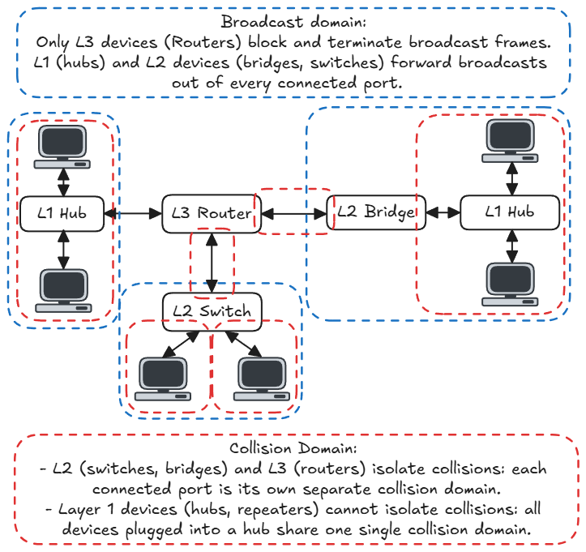

* *The Modern Switched Ethernet Reality:*
  * In modern switched networks, each host has a dedicated full-duplex cable to the switch. Collisions are physically impossible.
  * Consequently, modern Ethernet switches rarely trigger CSMA/CD in practice. CSMA/CD is retained in the standard for backward compatibility and explains why legacy constraints like the 64-byte minimum frame size still exist today.

---

### Domain Segmentation Summary

| Device | Operating Layer | Separates Collision Domains? | Separates Broadcast Domains? |
| :--- | :--- | :--- | :--- |
| **Repeater / Hub** | Layer 1 (Physical) | **No** (all ports = 1 shared collision domain) | **No** (all ports = 1 shared broadcast domain) |
| **Bridge / Switch** | Layer 2 (Data Link) | **Yes** (each individual port = 1 collision domain) | **No** (all ports = 1 shared broadcast domain) |
| **Router** | Layer 3 (Network) | **Yes** (each interface = 1 collision domain) | **Yes** (each interface = 1 broadcast domain) |

## Multi-Access Reservation Protocol (MARP)

### [Non-examinable] Motivation & Context
* **Contention Breakdown:** Random-access protocols (ALOHA, CSMA) work well under light load, but collapse under heavy traffic because collisions between long data frames waste large amounts of channel capacity.
* **Lack of Collision Detection (CD):** In wireless environments, transceivers cannot run CSMA/CD ("listen while talking") because their own transmit power drowns out faint incoming signals (self-interference) and hidden terminals prevent hearing collisions.
* **The Reservation Solution:** Instead of contending with long, vulnerable data payloads, time is split into two phases: nodes compete using tiny reservation mini-frames, then transmit their large data payload completely collision-free.
* **Why Not CSMA/CD in Wireless:** Transceivers cannot "listen while talking" because their own strong transmit power drowns out faint incoming signals, making collision detection impossible.
* **Contention Breakdown:** In pure random-access schemes, collisions between large data frames waste massive channel time under heavy load.
* **The MARP Solution:** Split time into two phases: nodes use small reservation mini-frames to compete for channel access, then transmit long data payloads completely collision-free.

---

### MARP Protocol Structure
MARP divides channel access into two sequential phases:

* **Phase 1: Channel Reservation:** Stations contend to reserve access using short reservation mini-frames of duration $v$.
* **Phase 2: Data Transmission:** Once a reservation succeeds, the winning station transmits a data frame of duration $u$ with zero collision risk.

```text
|<------------------------- Transmission Window ------------------------->|
+---------------------------------------------------+---------------------+
| Phase 1: Reservation Phase                        | Phase 2: Data Phase |
| Contention attempts using mini-frames of length v | Data frame length u |
| (Each attempt succeeds with probability S_r)      | (Collision-free)    |
+---------------------------------------------------+---------------------+
```

* **Core Parameters:**
  * $v$: Duration/time length of a reservation mini-frame.
  * $u$: Duration/time length of the actual data frame.
  * $S_r$: Channel utilization (success probability per trial) of the underlying MAC protocol running during Phase 1.

---

### Derivation of the Transmission Window
* Let $X$ represent the number of reservation attempts required to successfully book the channel:
  * Attempt succeeds on the first try ($X = 1$) with probability $S_r$.
  * Attempt succeeds on the $k$-th try (failing $k-1$ times, then succeeding) with probability:
    $$P(X = k) = S_r (1 - S_r)^{k-1}$$

* Because $X$ follows a **Geometric Distribution**, the expected number of trials is:
  $$E[X] = \frac{1}{S_r}$$

* Each reservation trial consumes $v$ units of time, making the average reservation phase duration:
  $$\text{Average Reservation Duration} = E[X] \times v = \frac{v}{S_r}$$

* The average total transmission window is therefore:
  $$\text{Transmission Window} = u + \frac{v}{S_r}$$

---

### Channel Utilization Formulas ($S$)

Channel utilization is defined as the fraction of time spent transmitting useful message data:
$$S = \frac{\text{Message Transmission Time}}{\text{Transmission Window}}$$

#### Case 1: Reservation Mini-Frame Carries NO Message Data Bits (Standard Case)
* Message data duration = $u$
* Total window duration = $u + \frac{v}{S_r}$
$$S = \frac{u}{u + \frac{v}{S_r}}$$

#### Case 2: Reservation Mini-Frame Carries Message Data Bits (Piggybacked)
* The successful reservation mini-frame itself carries part of the user data payload.
* Remaining message data to transmit in Phase 2 = $u - v$
* Total window duration = $(u - v) + \frac{v}{S_r}$
* Total message data sent = $u$
$$S = \frac{u}{(u - v) + \frac{v}{S_r}}$$

#### Maximizing MARP Utilization
Because data duration $u$ and mini-frame length $v$ are fixed parameters, MARP utilization $S$ is strictly maximized when the reservation phase efficiency $S_r$ is maximized:
$$\max(S) \iff \max(S_r)$$

* If Phase 1 uses **Slotted ALOHA**: Peak $S_r = 1/e \approx 0.368$ at offered load $G_r = 1.0$.
* If Phase 1 uses **Pure ALOHA**: Peak $S_r = 1/(2e) \approx 0.184$ at offered load $G_r = 0.5$.

---

### Worked Numerical Example (CRACK Framework)

* **Problem Statement:**
  An experimental LAN uses MARP. In Phase 1, it adopts some MAC protocol for transmission stations to reserve the channel. In Phase 2, when one station reserves the channel, it transmits one frame. The length of the reservation frame is $5\text{ ms}$, and the length of the data frame is $1\text{ s}$. No information bit is carried in the reservation frame. If the MAC protocol used in Phase 1 has a utilization of $0.5$, what is the utilization of the multi-access reservation protocol?

* **CRACK Breakdown:**
  * **C — Context:** 
    MARP with no user data bits carried in the reservation mini-frame.

  * **R — fRamework:** 
    Select the utilization formula for Case 1:
    $$S = \frac{u}{u + \frac{v}{S_r}}$$

  * **A — Apply:** 
    Extract and align given parameter units:

    * $u = 1\text{ s}$
    * $v = 5\text{ ms} = 0.005\text{ s}$
    * $S_r = 0.5$
  * **C — Calculation:** 
    Substitute values into the formula:
    $$S = \frac{1}{1 + \frac{0.005}{0.5}} = \frac{1}{1 + 0.01} = \frac{1}{1.01} \approx 0.9901 \quad (\approx 99\%)$$

  * **K — checK:** 
    * Verify $S \le 1$ holds true.
    * Since $v \ll u$ ($5\text{ ms} \ll 1000\text{ ms}$), reservation overhead is negligible compared to data transmission time, confirming high utilization near $1.0$ is physically realistic.

---

### Protocol Comparison Cheatsheet

| MAC Protocol | Carrier Sensing | Transmission Protocol | Collision Detection | Throughput / Utilization ($S$) | Key Exam Notes |
| :--- | :--- | :--- | :--- | :--- | :--- |
| **Pure ALOHA** | None | Transmit immediately upon frame arrival | None (corrupted frames transmitted to end) | $S = G e^{-2G}$ | Maximum $S \approx 18.4\%$ at $G = 0.5$. Vulnerable window $= 2 \times T_{\text{frame}}$. |
| **Slotted ALOHA** | None | Transmit only at the beginning of a time slot with probability $p$ | None (corrupted frames transmitted to end) | $S = G e^{-G}$ | Maximum $S \approx 36.8\%$ at $G = 1.0$. Vulnerable window cut in half to $1 \times T_{\text{frame}}$. |
| **Non-Persistent CSMA** | Yes (sense before talk) | If idle: transmit immediately. If busy: defer a random backoff time before sensing again. | None while sending (full corrupted frame transmitted) | Higher than ALOHA | Reduces collisions significantly, but wastes channel time due to overly cautious deferrals. |
| **1-Persistent CSMA** | Yes (sense before talk) | If idle: transmit immediately. If busy: continuously listen until idle, then transmit with probability $p = 1$. | None while sending (full corrupted frame transmitted) | Lower than non-persistent under high load | Highly aggressive; if 2+ nodes are waiting for an ongoing frame to finish, they collide immediately when it turns idle. |
| **p-Persistent CSMA** | Yes (sense before talk) | If idle: transmit with probability $p$; defer to next slot with probability $1-p$. | None while sending (full corrupted frame transmitted) | Adjustable tradeoff | Balances aggressiveness and collision risk via parameter $p$. |
| **CSMA/CD (Ethernet)** | Yes (sense before talk) | CSMA rules + listen while talk | **Yes:** Aborts transmission immediately upon collision and transmits a jam signal | Higher than pure CSMA | Minimum frame size requirement: $T_{\text{frame}} \ge 2\tau$. Uses Binary Exponential Backoff ($K = \min(i, 10)$). |
| **CSMA/CA (802.11)** | Yes (sense before talk) | If idle for DIFS: transmit. If busy: execute random backoff countdown. Receiver sends ACK after SIFS. | **No collision detection** (due to self-interference and hidden terminals) | Contention-based | Uses explicit link-layer ACKs. Mitigates hidden terminals using RTS/CTS frames and NAV virtual carrier sensing. |
| **MARP (Reservation)** | Uses random access in Phase 1 | Two phases: Phase 1 reserves slot using mini-frame $v$; Phase 2 transmits data frame $u$. | Eliminated in data phase (dedicated collision-free slots) | $S = \frac{u}{u + v/S_r}$ (no data in mini-frame)<br>$S = \frac{u}{(u - v) + v/S_r}$ (data in mini-frame) | Ideal for heavy load; isolates contention overhead to small reservation slots $v$. |
