# Data Link Layer (DLL): Medium Access Control & LANs


## 1. MAC Architecture & Protocol Taxonomy

### 1.1 The MAC Problem
* **Shared Broadcast Medium:** Multiple stations share a single communication channel.
* **Collision:** Occurs when two or more stations transmit simultaneously, causing overlapping electromagnetic signals that corrupt frames at the receiver.
* **No Out-of-Band Channel:** Coordination and channel arbitration must be conducted over the shared data medium itself.
* **Ideal MAC Protocol ("Genie-Aided"):**
  * Transmits at full rate $R$ when only 1 station is active.
  * Achieves fair sharing: each of $M$ active stations gets an average throughput of $R/M$.
  * Fully decentralized (no single point of failure, no central controller, no master clock synchronization).
  * Minimal protocol overhead.

> **Context: LAN Architecture & Topologies**
> * **Topologies:** Legacy *Bus/Tree* networks use a passive broadcast cable terminated with resistors. *Ring* networks pass frames unidirectionally through repeaters. *Star* topologies connect nodes to a central box (behaving like a logical bus when using a Layer 1 Hub, or isolated dedicated links when using a Layer 2 Switch).
> * **Channel Allocation Options:** *Static* schemes (TDM, FDM) waste bandwidth when traffic is bursty. *Dynamic Controlled* schemes (Polling, Token Passing, Reservation) eliminate collisions but add latency under light loads. *Dynamic Contention* schemes (Random Access) let stations transmit on demand at full rate $R$, accepting collision risks.

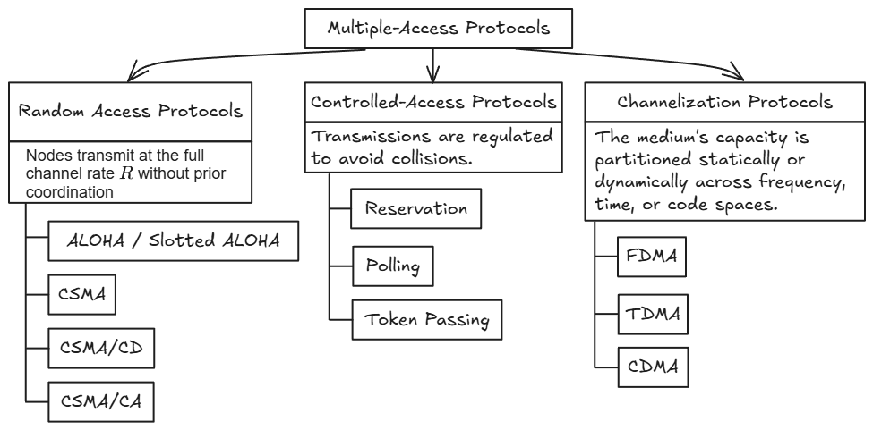

---

### 1.2 The Three Design Decisions of Random Access MAC
1. **Carrier Sensing:** Does the station check the channel status before transmitting (e.g., blind sending in ALOHA vs. "listen before talk" in CSMA)?
2. **Transmission Policy:** How does the station transmit once the channel becomes free (e.g., immediate sending vs. persistent/probabilistic deferred sending)?
3. **Collision Detection & Recovery:** How does the station detect and handle a collision (e.g., abort immediately and back off in CSMA/CD vs. waiting for upper-layer ACK timeouts)?

---

## 2. Random Access Protocols: ALOHA Family

### 2.1 Slotted ALOHA
* **Assumptions:**
  * Discrete synchronized time slots; slot duration equals frame transmission time ($T_{\text{slot}} = T_{\text{frame}}$).
  * Nodes transmit exclusively at slot boundaries.
  * If $\ge 2$ nodes transmit in the same slot, a collision occurs; all colliding nodes detect the collision, drop the frame, and retransmit in subsequent slots with probability $p$.

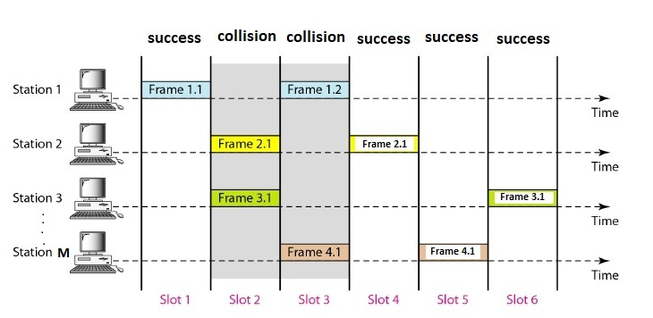

* **Slot Throughput Derivation ($S$):**
  * For $N$ independent nodes each transmitting with probability $p$:
    * Single node $i$ succeeds:
      $$Pr(S_i) = p(1 - p)^{N-1}$$
    * Total probability of a successful slot:
      $$Pr(S) = \sum_{i=1}^N Pr(S_i) = Np(1 - p)^{N-1}$$
* **Offered Load ($G$) & Infinite Node Limit ($N \to \infty$):**
  * Let $G = Np$ represent the average number of transmission attempts generated by the entire network per slot.
  * Taking the limit as $N \to \infty$ ($p \to 0$):
    $$S = \lim_{N \to \infty} N\left(\frac{G}{N}\right)\left(1 - \frac{G}{N}\right)^{N-1} = G e^{-G}$$
* **Peak Throughput Optimization:**
  $$\frac{dS}{dG} = e^{-G}(1 - G) = 0 \implies G^* = 1.0$$
  $$S_{\max} = 1 \cdot e^{-1} = \frac{1}{e} \approx 0.368 \quad (36.8\%)$$
* **Slot Distribution at Peak Operating Point ($G = 1.0$):**
  * $Pr(\text{Successful Slot}) = 1/e \approx 36.8\%$
  * $Pr(\text{Empty / Idle Slot}) = e^{-1} \approx 36.8\%$
  * $Pr(\text{Collision Slot}) = 1 - 2e^{-1} \approx 26.4\%$

---

### 2.2 Pure (Unslotted) ALOHA
* **Assumptions:**
  * Continuous time; no slotting, no global clock synchronization.
  * Stations transmit immediately whenever data arrives.
  * Any partial frame overlap (even by a single bit) destroys all overlapping frames.

* **Vulnerable Window Derivation ($2T$):**
  * Let frame transmission time be $T$.
  * A target frame transmitted from $t_0$ to $t_0 + T$ is corrupted if:
    * Another frame begins in $(t_0 - T, t_0)$ (collides with target's beginning).
    * Another frame begins in $[t_0, t_0 + T)$ (collides with target's end).
  * Total vulnerable time window is $2T$.

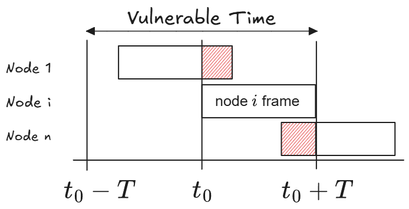

* **Throughput Derivation ($S$):**
  * Assuming Poisson arrivals with rate $G$ attempts per frame time $T$, expected attempts in window $2T$ is $2G$:
    $$Pr(\text{No Collision}) = P(k = 0) = \frac{(2G)^0 e^{-2G}}{0!} = e^{-2G}$$
    $$S = G e^{-2G}$$
* **Peak Throughput Optimization:**
  $$\frac{dS}{dG} = e^{-2G}(1 - 2G) = 0 \implies G^* = 0.5$$
  $$S_{\max} = 0.5 \cdot e^{-1} = \frac{1}{2e} \approx 0.184 \quad (18.4\%)$$
* **Collision Penalty:** Senders cannot detect collisions during transmission. Corrupted frames are transmitted to completion, fail receiver CRC, and are discarded without returning an ACK. Senders learn of frame loss only after an ACK timeout.

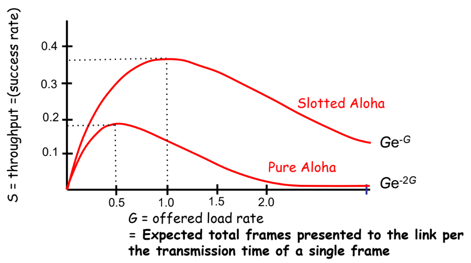

---

## 3. Carrier Sense Multiple Access (CSMA)

### 3.1 Carrier Sense Principle & Vulnerable Window ($\tau$)
* **Core Rule:** "Listen before transmit" (LBT). A station senses the channel carrier before transmitting:
  * Channel Idle: Transmit frame.
  * Channel Busy: Defer transmission.
* **Vulnerable Window ($\tau$):**
  * Carrier sensing does not eliminate all collisions due to finite signal propagation speed.
  * Let $\tau$ be the maximum end-to-end propagation delay between the two farthest nodes.
  * If Node A starts transmitting at $t_0$, Node B cannot detect the carrier until $t_0 + \tau$. If Node B senses the medium before $t_0 + \tau$, it sees an idle line and transmits, causing a collision.
  * The vulnerable window is reduced from $T_{\text{frame}}$ (ALOHA) to $\tau$ (propagation delay).

---

### 3.2 Persistence Variants

| Strategy | Behavior When Channel is Idle | Behavior When Channel is Busy | Operational Characteristic |
| :--- | :--- | :--- | :--- |
| **1-Persistent** | Transmits immediately ($p = 1$). | Continuously listens until idle, then transmits immediately ($p = 1$). | Zero idle delay under light load; guaranteed collisions under high load when $\ge 2$ stations defer during an ongoing frame. |
| **Non-Persistent** | Transmits immediately. | Abandons continuous sensing, waits a random backoff interval, then re-senses. | Drastically reduces collisions under high load; wastes channel time waiting out backoffs when channel is actually idle. |
| **$p$-Persistent** *(Slotted)* | Transmits with probability $p$; defers to next slot with probability $1 - p$. | Continuously listens until idle, then applies the probabilistic slot rule. | Tunable tradeoff via parameter $p$. As $p \to 1$, acts like 1-persistent; as $p \to 0$, idle slot latency spikes. |

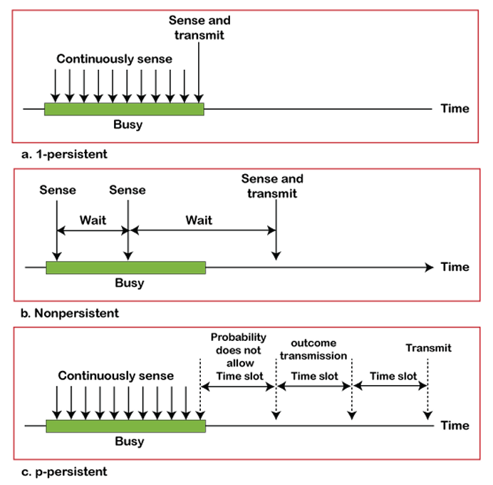

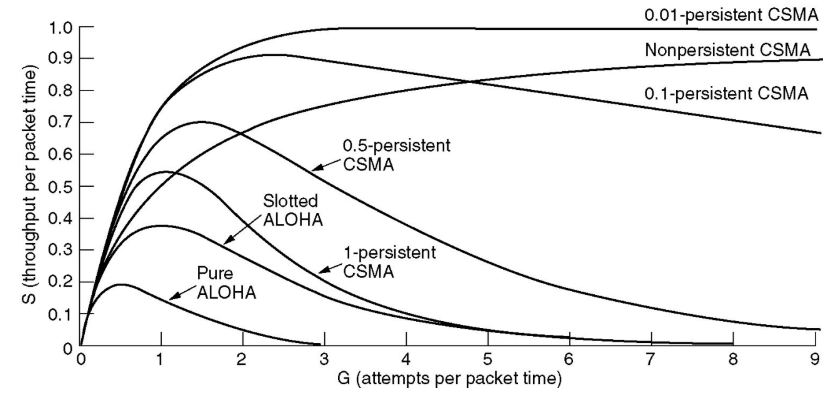

* **Load Performance Summary:**
  * **1-Persistent:** Maximizes throughput at very light load ($G < 1$), but collapses under heavy traffic.
  * **Non-Persistent:** Stays stable under heavy load ($S \approx 0.8\text{--}0.9$) because random backoffs desynchronize contenders.
  * **$p$-Persistent:** Small $p$ (e.g., $p = 0.01$) reaches near $1.0$ throughput under heavy load at the expense of high idle delay under light traffic.

---

## 4. CSMA with Collision Detection (CSMA/CD)

### 4.1 Collision Detection Principle
* **Motivation:** In standard CSMA, colliding stations transmit full frames to completion, wasting channel bandwidth.
* **Listen While Talking:** Stations monitor medium power/voltage during transmission. If observed signal energy exceeds transmitted energy, a collision is detected.
* **Repeating Hubs (Layer 1):** Detect simultaneous inputs across two or more ports and broadcast a collision presence signal out of all ports.

---

### 4.2 Worst-Case Collision Detection Time Window ($2a$)
* Let $a = \tau$ denote the maximum one-way propagation delay between the two most distant stations (A and B).
* **Worst-Case Timeline:**
  1. $t = T_0$: Station A begins transmitting on an idle channel.
  2. $t = T_0 + a - \epsilon$: Just before A's signal reaches B, Station B senses idle and transmits.
  3. $t = T_0 + a$: Collision occurs at Station B; B detects it immediately.
  4. $t \approx T_0 + 2a$: Corrupted collision wavefront propagates back to Station A; A detects the collision.
* **Key Invariant:** Detecting a collision takes **up to twice the maximum propagation delay ($2a$ or $2\tau$)**.

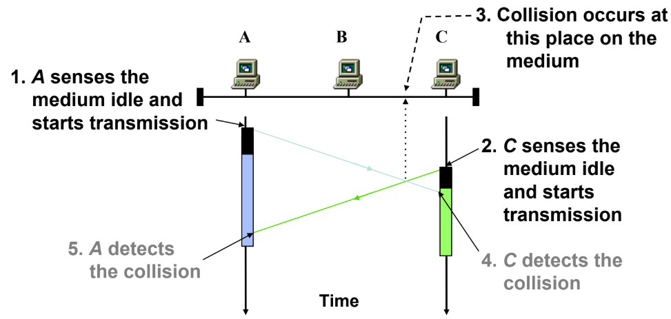

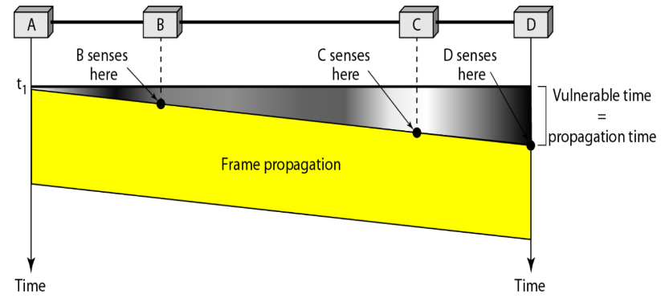

* **Collision Handling Sequence:**
  1. **Abort Transmission:** Immediately cease data frame transmission.
  2. **Transmit Jam Signal (48 bits):** Emit a 48-bit jam signal to prolong the disturbance so all network adapters detect the collision and discard frame fragments.
  3. **Execute Backoff:** Enter Binary Exponential Backoff before attempting to re-sense the medium.

---

## 5. Wired LAN: Ethernet (IEEE 802.3)

### 5.1 Ethernet Frame Structure

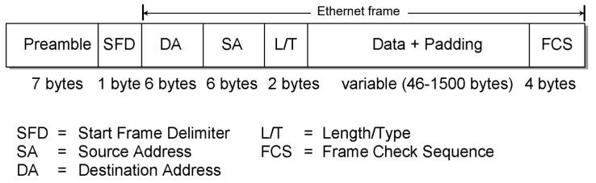

* **Preamble (7 bytes):** 56 alternating bits (`10101010...`) for receiver clock synchronization.
* **Start Frame Delimiter (SFD, 1 byte):** Pattern `10101011` indicating the start of the valid MAC frame.
* **Destination Address (DA, 6 bytes / 48 bits):** Hardware MAC address of the destination adapter.
* **Source Address (SA, 6 bytes / 48 bits):** Hardware MAC address of the sending adapter.
* **Length / Type (L/T, 2 bytes):** Length of data field or upper-layer protocol identifier (e.g., IPv4, ARP).
* **Data + Padding (46 to 1500 bytes):**
  * Maximum payload (MTU) = 1500 bytes.
  * Minimum payload = 46 bytes (dummy padding is appended if data $< 46\text{ bytes}$).
* **Frame Check Sequence (FCS, 4 bytes):** 32-bit CRC covering DA through Padding.

---

### 5.2 Destination Address Classification Rules
Every network adapter has a unique 48-bit (6-byte) MAC address written as 6 hex octets: `XX:XX:XX:XX:XX:XX`.

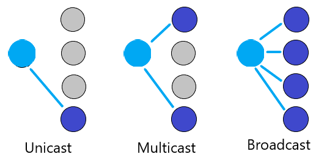{width=60%}

* **Bit Inspection Rule:** Examine the least significant bit (LSB) of the first byte (the 2nd hex digit from the left):
  * **Unicast (One-to-One):** LSB is `0` $\implies$ 2nd hex digit is **even** (`0, 2, 4, 6, 8, A, C, E`).
  * **Multicast (One-to-Many):** LSB is `1` $\implies$ 2nd hex digit is **odd** (`1, 3, 5, 7, 9, B, D, F`).
  * **Broadcast (One-to-All):** All 48 bits are `1`s $\implies$ `FF:FF:FF:FF:FF:FF`.

* **Evaluation Examples:**
  * `4A:30:10:21:10:1A` $\to$ 2nd digit is `A` ($1010_2$, ends in 0, even) $\implies$ **Unicast**.
  * `47:20:1B:2E:08:EE` $\to$ 2nd digit is `7` ($0111_2$, ends in 1, odd) $\implies$ **Multicast**.
  * `FF:FF:FF:FF:FF:FF` $\to$ All digits are `F` $\implies$ **Broadcast**.

---

### 5.3 Minimum Frame Size Derivation
* **The Core Constraint:** In CSMA/CD, transceivers only listen for collisions while actively transmitting. To guarantee a sender detects a worst-case collision before it finishes transmission:
  $$T_{\text{frame}} \ge 2\tau$$
  $$L_{\min} = 2\tau \cdot R$$
* **Standard 10 Mbps Ethernet Derivation:**
  * Maximum network span: 2500 m $\implies 2\tau = 51.2\ \mu\text{s}$ (Slot Time).
  * Bit transmission time at $R = 10\text{ Mbps}$: $\frac{1}{10 \times 10^6} = 0.1\ \mu\text{s/bit}$.
  * Minimum frame length:
    $$L_{\min} = \frac{51.2\ \mu\text{s}}{0.1\ \mu\text{s/bit}} = 512\text{ bits} = \mathbf{64\text{ bytes}}$$
  * Mandatory MAC Header & Trailer:
    $$\text{DA (6B)} + \text{SA (6B)} + \text{Length/Type (2B)} + \text{CRC FCS (4B)} = \mathbf{18\text{ bytes}}$$
    *(Preamble and SFD are physical layer framing and are excluded from the MAC frame length).*
  * Minimum Data Payload:
    $$\text{Minimum Payload} = 64\text{ bytes} - 18\text{ bytes} = \mathbf{46\text{ bytes}}$$

---

### 5.4 Binary Exponential Backoff (BEB) Algorithm
* **Purpose:** Dynamically adjusts backoff delay to desynchronize contending stations following collisions.
* **Slot Unit:** Multiples of slot time ($51.2\ \mu\text{s}$).
* **Algorithm Execution on Collision $i$:**
  1. Set backoff exponent:
     $$k = \min(i, 10)$$
  2. Pick random integer $K$ uniformly:
     $$K \in \{0, 1, 2, \ldots, 2^k - 1\}$$
  3. Defer transmission for delay period:
     $$\text{Delay} = K \times 51.2\ \mu\text{s}$$
  4. Cap & Abort: Contention window caps at $2^{10} - 1 = 1023$. If collisions reach 16 attempts (`attempts == 16`), transmission aborts and an error is reported.

* **Collision Probability for 2 Stations ($A$ and $B$):**
  * **1st Collision ($i = 1$):** $K \in \{0, 1\}$, window size $W = 2$:
    $$P(\text{Collision}) = P(A=0, B=0) + P(A=1, B=1) = (0.5 \times 0.5) + (0.5 \times 0.5) = \mathbf{0.5} \quad (50\%)$$
  * **2nd Collision ($i = 2$):** $K \in \{0, 1, 2, 3\}$, window size $W = 4$:
    $$P(\text{Collision}) = 4 \times (0.25 \times 0.25) = \mathbf{0.25} \quad (25\%)$$
  * **General Formula for 2 Stations across Window $W = 2^k$:**
    $$P(\text{Collision}) = \frac{1}{W} = \frac{1}{2^k}$$

---

## 6. Hardware Devices & Domain Segmentation

### 6.1 Device Taxonomy
* **Layer 1 (Repeaters & Hubs):** Blind electrical repeaters. No frame inspection, no memory buffering. Echo incoming bits to all other ports. **Do not isolate collisions; do not isolate broadcasts.**
* **Layer 2 (Bridges & Switches):** Frame inspection based on MAC addresses. Buffer frames in internal memory. Forward frames selectively to destination ports. **Isolate collision domains per port; do not isolate broadcasts.**
* **Layer 3 (Routers):** Packet forwarding based on IP addresses. Terminate Layer 2 networks. **Isolate collision domains per port; isolate broadcast domains per interface.**

---

### 6.2 Collision vs. Broadcast Domains

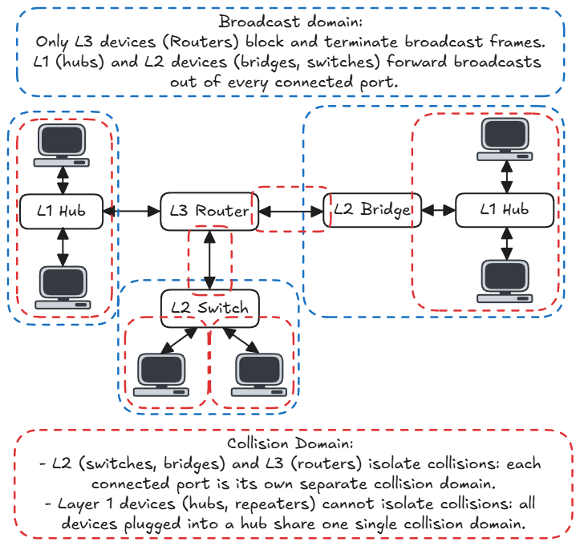

* **Collision Domain:** A physical network segment where simultaneous transmissions cause signal collisions.
  * Hubs/Repeaters merge all connected devices into **1 single collision domain**.
  * Switches, Bridges, and Routers create a **separate collision domain on every individual port**.
* **Broadcast Domain:** The scope across which a broadcast frame (`FF:FF:FF:FF:FF:FF`) propagates.
  * Hubs, Repeaters, Switches, and Bridges all forward broadcast frames across all ports (**1 shared broadcast domain**).
  * Routers block Layer 2 broadcasts, making **each router interface a separate broadcast domain**.

| Network Device | Operating Layer | Splits Collision Domains? | Splits Broadcast Domains? |
| :--- | :---: | :---: | :---: |
| **Repeater / Hub** | Layer 1 | **No** (all ports share 1 domain) | **No** (all ports share 1 domain) |
| **Bridge / Switch** | Layer 2 | **Yes** (each port is 1 domain) | **No** (all ports share 1 domain) |
| **Router** | Layer 3 | **Yes** (each port is 1 domain) | **Yes** (each interface is 1 domain) |

---

## 7. Multi-Access Reservation Protocol (MARP)

### 7.1 Protocol Architecture
* **Motivation:** Random access protocols collapse under heavy traffic due to frame collisions. Wireless channels cannot use CSMA/CD because transceiver transmit power drowns out received signals and hidden terminals prevent hearing collisions.
* **Mechanism:** Channel time is partitioned into two phases:
  * **Phase 1 (Reservation Phase):** Stations contend for channel access using short reservation mini-frames of duration $v$.
  * **Phase 2 (Data Phase):** The winning station transmits its full data frame of duration $u$ collision-free.

```text
|<------------------------- Transmission Window ------------------------->|
+---------------------------------------------------+---------------------+
| Phase 1: Reservation Phase                        | Phase 2: Data Phase |
| Contention attempts using mini-frames of length v | Data frame length u |
| (Each attempt succeeds with probability S_r)      | (Collision-free)    |
+---------------------------------------------------+---------------------+
```

---

### 7.2 Transmission Window & Utilization Formulas
* Let $X$ be the number of reservation attempts required to succeed:
  * Since each trial succeeds with probability $S_r$ (the utilization of Phase 1 MAC), $X$ follows a geometric distribution:
    $$E[X] = \frac{1}{S_r}$$
  * Average reservation duration $= E[X] \times v = \frac{v}{S_r}$.
  * Total transmission window duration $= u + \frac{v}{S_r}$.

* **Case 1: Reservation Mini-Frame Carries NO User Data (Standard Case):**
  $$S = \frac{\text{Data Transmission Time}}{\text{Total Window Duration}} = \frac{u}{u + \frac{v}{S_r}}$$

* **Case 2: Reservation Mini-Frame Carries User Data (Piggybacked):**
  * Remaining data to transmit in Phase 2 $= u - v$.
  * Total window duration $= (u - v) + \frac{v}{S_r}$.
  $$S = \frac{u}{(u - v) + \frac{v}{S_r}}$$

* **Maximizing MARP Utilization:**
  * For fixed data duration $u$ and mini-frame length $v$, MARP utilization $S$ is maximized when $S_r$ is maximized:
    $$\max(S) \iff \max(S_r)$$
  * If Phase 1 uses **Slotted ALOHA**: $S_r^{\max} = 1/e \approx 0.368$ (at $G_r = 1.0$).
  * If Phase 1 uses **Pure ALOHA**: $S_r^{\max} = 1/(2e) \approx 0.184$ (at $G_r = 0.5$).

---

### 7.3 Worked Exam Problem (CRACK Framework)
* **Problem:** An experimental LAN uses MARP. In Phase 1, the reservation protocol has utilization $S_r = 0.5$. Reservation frame length $v = 5\text{ ms}$, data frame length $u = 1\text{ s}$. No data bits are carried in the reservation frame. Calculate total MARP utilization $S$.
* **Step 1 (Framework):** Select Case 1 formula:
  $$S = \frac{u}{u + \frac{v}{S_r}}$$
* **Step 2 (Apply Units):** $u = 1\text{ s}$, $v = 5\text{ ms} = 0.005\text{ s}$, $S_r = 0.5$.
* **Step 3 (Calculation):**
  $$S = \frac{1}{1 + \frac{0.005}{0.5}} = \frac{1}{1 + 0.01} = \frac{1}{1.01} \approx \mathbf{0.9901} \quad (99.01\%)$$
* **Step 4 (Check):** Since $v \ll u$ ($5\text{ ms} \ll 1000\text{ ms}$), reservation overhead is negligible, verifying $S \approx 0.99 \le 1.0$.

---

## 8. Master Protocol Comparison Cheatsheet

| MAC Protocol | Carrier Sensing | Transmission Strategy | Collision Detection | Throughput / Utilization ($S$) | Key Exam Constants & Constraints |
| :--- | :--- | :--- | :--- | :--- | :--- |
| **Pure ALOHA** | None | Transmit immediately upon frame arrival | None (corrupted frames transmitted to end) | $S = G e^{-2G}$ | Peak $S \approx 18.4\%$ at $G = 0.5$. Vulnerable window $= 2 T_{\text{frame}}$. |
| **Slotted ALOHA** | None | Transmit only at slot boundary with probability $p$ | None (corrupted frames transmitted to end) | $S = G e^{-G}$ | Peak $S \approx 36.8\%$ at $G = 1.0$. Vulnerable window $= 1 T_{\text{frame}}$. |
| **Non-Persistent CSMA** | Yes (LBT) | If idle: send. If busy: wait random backoff before sensing again. | None while sending | Higher than ALOHA across loads | Desynchronizes contenders; prevents high-load channel collapse. |
| **1-Persistent CSMA** | Yes (LBT) | If idle: send. If busy: continuously listen until idle, then send with $p = 1$. | None while sending | Lower than non-persistent under heavy load | Zero idle delay under light load; guaranteed collisions under high load. |
| **$p$-Persistent CSMA** | Yes (LBT) | If idle: send with prob $p$, defer a slot with prob $1-p$. If busy: listen until idle. | None while sending | Tunable by setting parameter $p$ | Approaching $p \to 0$ suppresses collisions under heavy load at cost of idle delay. |
| **CSMA/CD (Ethernet)** | Yes (LBT) | 1-Persistent sensing + listen while talking | Yes (aborts transmission, sends 48-bit jam signal) | High channel efficiency | $T_{\text{frame}} \ge 2\tau \implies L_{\min} = 64\text{ bytes}$ ($46\text{B payload} + 18\text{B overhead}$). Backoff cap at $K = \min(i, 10)$, abort at 16. |
| **CSMA/CA (802.11)** | Yes (LBT) | Sense idle for DIFS, then send. If busy: random backoff countdown. Receiver ACKs after SIFS. | No (due to transceiver self-interference and hidden terminals) | Contention-based | Uses explicit link-layer ACKs and optional RTS/CTS handshaking with NAV reservation. |
| **MARP (Reservation)** | Uses random access in Phase 1 | Contend with mini-frame $v$ in Phase 1; transmit data frame $u$ in Phase 2. | Collision-free in Phase 2 | $S = \frac{u}{u + v/S_r}$ (no data in mini-frame)<br>$S = \frac{u}{(u - v) + v/S_r}$ (piggybacked) | Eliminates contention waste for large frames under high load. Maximized when $S_r$ is maximized. |
