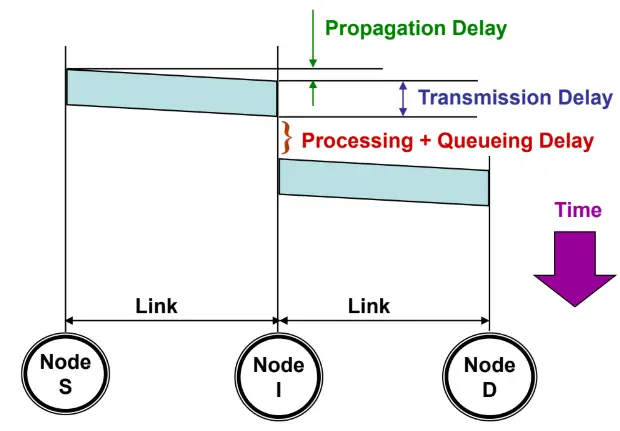

# Network Paradigms & Delay Analysis

## 1. Network Switching Paradigms

A switching network routes data between endpoints across intermediate nodes without requiring direct, dedicated physical wires between every pair of devices.

### 1.1 Circuit Switching Networks
* **Core Principle:** A dedicated, physical communication path is reserved and locked across intermediate switches before any data can be transmitted.
* **The Three Operational Phases:**
  1. **Circuit Establishment:** A setup signal travels link-by-link through the switches to locate and lock physical transmission resources (channels, frequencies, or time slots). If any intermediate link lacks sufficient capacity, the request is blocked.
  2. **Ordered Data Transfer:** Data streams continuously through the reserved physical circuit. No intermediate queuing delay occurs at intermediate switches. Packets require no per-hop addressing or routing headers after setup because the physical path is locked end-to-end.
  3. **Circuit Disconnect:** When communication ends, a teardown signal releases the locked resources back to the network pool.

* **Trunk Line Capacity Dimensioning:**
  $$\text{Concurrent Connections} = \frac{\text{Trunk Bandwidth}}{\text{Bandwidth per Connection}}$$
  * *Worked Example:* A trunk line has capacity $R_{\text{trunk}} = 10\text{ Gbps} = 10 \times 10^9\text{ bps}$. Each standard voice call requires $R_{\text{call}} = 64\text{ kbps} = 64 \times 10^3\text{ bps}$:
    $$\text{Concurrent Calls} = \frac{10 \times 10^9\text{ bps}}{64 \times 10^3\text{ bps}} = \frac{10{,}000{,}000}{64} \approx \mathbf{156{,}250\text{ calls}}$$

---

### 1.2 Packet Switching Networks
* **Core Principle:** Long messages are segmented into smaller, bounded discrete blocks called **packets** (typically around 1000 bytes).
* **Packet Structure:**
  * **Payload:** Segment of raw user data.
  * **Header:** Control bytes containing source and destination identifiers, sequence numbers, and error check codes.
* **Store-and-Forward Invariant:** An intermediate switch cannot forward bits dynamically as they arrive. It must buffer and validate the **entire packet** into internal memory before transmitting the first bit onto the outgoing link.

---

### 1.3 Datagram vs. Virtual-Circuit Packet Switching

#### A. Datagram Packet Switching (Connectionless)
* **No Path Reservation:** Packets enter the network immediately with zero setup delay.
* **Full Header Overhead:** Every individual packet carries complete Layer 3 source and destination addresses.
* **Independent Dynamic Routing:** Each intermediate router independently checks its forwarding table for each incoming packet based on current link traffic and topology states. Consecutive packets of the same message can follow completely different paths.
* **Out-of-Order Delivery:** Because packets may traverse different routes with varying propagation delays and queue lengths, packets frequently arrive out of order. The destination host relies on header **sequence numbers** to reassemble the data in correct sequence.
* **Implementation:** The modern Internet Protocol (IPv4 / IPv6).

#### B. Virtual-Circuit (VC) Packet Switching (Connection-Oriented)
* **Pre-Established Logical Route:** A signaling phase determines and locks a fixed logical path before data transfer begins. All data packets follow this predetermined route sequentially.
* **Virtual Circuit Identifier (VCI):** Packets do not carry full source and destination IP addresses. Instead, each packet carries a short local identifier (VCI). Routers maintain internal translation tables mapping `(Incoming Interface, VCI)` to `(Outgoing Interface, Next VCI)`.
* **Shared Capacity (No Exclusive Resource Reservation):** Unlike circuit switching, **no physical bandwidth or memory buffers are exclusively reserved**. Transmission links remain dynamically shared across all active network traffic. If a user stops transmitting, other users consume the unused link bandwidth.
* **The Setup Routing Invariant:** Virtual circuit networks still require connectionless packet-routing capability in their control plane to route the initial connection setup packets from an arbitrary source to an arbitrary destination.
* **Implementation:** X.25 (used in aviation/avionics), ATM, Frame Relay.

---

## 2. Switching Paradigms Side-by-Side Comparison

| Feature | Circuit Switching | Datagram Packet Switching | Virtual-Circuit Packet Switching |
| :--- | :--- | :--- | :--- |
| **Path Setup Phase** | Mandatory before transmission | None (immediate transmission) | Mandatory before transmission |
| **Resource Reservation** | Dedicated / Exclusive (bandwidth locked) | None (dynamically shared) | None (dynamically shared) |
| **Path Determination** | Dedicated physical path | Dynamic (packets take varying paths) | Fixed logical path |
| **Packet Sequence** | Strictly in-order arrival | Packets may arrive out of sequence | Contiguous in-order arrival |
| **Per-Packet Overhead** | Zero header bits after setup | Full Source & Destination addresses | Lightweight local identifier (VCI) |
| **Queuing Delay** | Zero queuing delay at switches | Variable (depends on link congestion) | Variable (depends on link congestion) |
| **Network Overload** | Blocks new connection setups (busy tone) | Packets queue up; packets drop on overflow | Packets queue up; packets drop on overflow |
| **Failure Impact** | Entire connection fails if any link breaks | Packets dynamically reroute around failed links | Entire connection fails; VC must be rebuilt |

---

## 3. Network Delay Analysis

### 3.1 The Four Components of Total Packet Delay
Total nodal delay for a packet traversing an intermediate hop is the sum of four discrete components:
$$d_{\text{nodal}} = d_{\text{proc}} + d_{\text{queue}} + d_{\text{trans}} + d_{\text{prop}}$$

1. **Processing Delay ($d_{\text{proc}}$):** Time taken by the intermediate router to inspect packet headers, check for bit errors, and consult forwarding tables to select the outgoing interface (typically microseconds).
2. **Queuing Delay ($d_{\text{queue}}$):** Time the packet spends waiting in router memory buffers until the outgoing transmission link becomes available. Varies based on network traffic load.
3. **Transmission Delay ($d_{\text{trans}}$ or $T_x$):** Time required to emit/push all bits of the packet onto the physical communication wire:
   $$d_{\text{trans}} = \frac{L}{R}$$
   * $L$: Total packet length in bits (payload + header).
   * $R$: Channel transmission rate / link bandwidth (bps).
4. **Propagation Delay ($d_{\text{prop}}$ or $d$):** Time taken by a single physical bit to travel across the physical medium from transmitter to receiver:
   $$d_{\text{prop}} = \frac{D}{V}$$
   * $D$: Physical link distance (meters).
   * $V$: Propagation speed in medium ($2 \times 10^8\text{ m/s}$ in fiber/copper, $3 \times 10^8\text{ m/s}$ in free space).

---

### 3.2 Circuit Switching Latency Model
Once the physical circuit is established, switches introduce zero store-and-forward buffering. Bits pass through intermediate nodes at propagation velocity:
$$T_{\text{Circuit}} = s + \frac{x}{b} + k \cdot d$$

* $s$: Physical circuit setup time (seconds).
* $x$: Total message size in bits.
* $b$: Transmission data rate (bps).
* $k$: Number of hops ($N_{\text{nodes}} - 1$).
* $d$: Propagation delay per hop (seconds).

---

### 3.3 Packet Switching: Pipelining & Store-and-Forward Latency

#### The Hop Invariant
A network path consisting of $N$ nodes contains $k$ hops:
$$k = N - 1$$

#### The Pipelining Principle
Under store-and-forward packet switching:
1. Node 1 pushes Packet 1 onto Link 1.
2. Once Node 2 receives the entirety of Packet 1, Node 2 forwards Packet 1 onto Link 2.
3. Concurrently, Node 1 immediately begins pushing Packet 2 onto Link 1.
4. Intermediate links operate in parallel, pipelining packet delivery across the multi-hop path.

#### General Pipelined Delay Formula (Lightly Loaded, Zero-Queuing)
For an unfragmented message of $x$ bits divided into $P$ packets, where each packet has size $p$ bits ($P = x/p$), traversing $k$ hops at bitrate $b$ with per-hop propagation delay $d$:

$$T_{\text{Packet}} = (\text{Time for Packet 1 to reach Destination}) + (\text{Time for remaining } P - 1 \text{ packets to clear last hop})$$

$$T_{\text{Packet}} = k \cdot (T_x + d) + (P - 1) \cdot T_x$$

where $T_x = \frac{p}{b}$ is the per-packet transmission delay.

Expanding algebraically:
$$T_{\text{Packet}} = k \cdot \frac{p}{b} + k \cdot d + \left(\frac{x}{p} - 1\right)\frac{p}{b} = \frac{x}{b} + (k - 1)\frac{p}{b} + k \cdot d$$

* **Special Case (Negligible Propagation Delay, $d \approx 0$):**
  $$T_{\text{Packet}} = (P + k - 1) \cdot T_x$$

---

### 3.4 Circuit vs. Packet Switching Crossover Inequality
Under what conditions does packet switching achieve lower total latency than circuit switching?

$$T_{\text{Packet}} < T_{\text{Circuit}}$$
$$\frac{x}{b} + (k - 1)\frac{p}{b} + k \cdot d < s + \frac{x}{b} + k \cdot d$$

Subtracting $\frac{x}{b} + k \cdot d$ from both sides:
$$(k - 1)\frac{p}{b} < s$$

* **Exam Takeaway:** The crossover threshold depends strictly on the hop count ($k$), packet size ($p$), bitrate ($b$), and setup time ($s$). **Total message length ($x$) and propagation delay ($k \cdot d$) cancel out completely!**

---

### 3.5 Switch Processing Delay Significance Test
To evaluate whether internal switch processing time ($T_{\text{switch}}$) is significant compared to physical propagation delay across a total distance $D$ at velocity $V$:
1. Convert switch processing delay into an **equivalent cable length**:
   $$D_{\text{eq}} = T_{\text{switch}} \times V$$
2. Determine total extra virtual distance added by all switches:
   $$D_{\text{extra}} = N_{\text{switches}} \times D_{\text{eq}}$$
3. Compute the delay impact ratio:
   $$\text{Impact Ratio} = \frac{D_{\text{extra}}}{D_{\text{total}}}$$
   If this ratio is very small (e.g., $< 5\%$), switch delay is negligible compared to physical propagation delay.

---

## 4. Exam Problem Archetypes

### Archetype 1: Pipelined Link Rate Dimensioning with Headers
* **Problem:** Two nodes (S and D) connect through one intermediate node I ($N = 3$ nodes, $k = 2$ hops). A 1000-byte message is sent from S to D. The message is split into 4 packets, each carrying a 50-byte header. Links run at identical data rates. Propagation delay is negligible. Find the minimum link data rate required to achieve a total delivery time under 100 ms.
* **Step 1: Compute packet size ($p$):**
  $$\text{Payload per packet} = \frac{1000\text{ bytes}}{4} = 250\text{ bytes}$$
  $$\text{Total packet size } p = 250\text{ bytes (data)} + 50\text{ bytes (header)} = 300\text{ bytes} = 2400\text{ bits}$$
* **Step 2: Express total transmission delay using pipelining:**
  For $P = 4$ packets traversing $k = 2$ hops:
  $$T_{\text{total}} = (P + k - 1) \cdot T_f = (4 + 2 - 1) \cdot T_f = 5 \cdot T_f$$
* **Step 3: Solve for link data rate ($b$):**
  $$T_{\text{total}} < 100\text{ ms} \implies 5 \cdot T_f < 0.1\text{ s} \implies T_f < 0.02\text{ s}$$
  $$T_f = \frac{p}{b} < 0.02 \implies b > \frac{p}{0.02} = \frac{2400\text{ bits}}{0.02\text{ s}} = \mathbf{120\text{ kbps}}$$

---

### Archetype 2: Circuit vs. Packet Switching Comparison
* **Problem:** An $x$-bit message is sent over a $k$-hop path where each hop has propagation delay $d$ seconds and data rate $b$ bps. Circuit setup time is $s$ seconds. Packet size is $p$ bits.
  1. Write the total delay expressions for both switching methods.
  2. Derive the exact mathematical condition under which packet switching delivers lower delay than circuit switching.
* **Step 1: Write total delay expressions:**
  * Circuit switching:
    $$T_{\text{Circuit}} = s + \frac{x}{b} + kd$$
  * Packet switching (number of packets $P = x/p$):
    $$T_{\text{Packet}} = k\left(\frac{p}{b} + d\right) + (P - 1)\frac{p}{b} = \frac{x}{b} + (k - 1)\frac{p}{b} + kd$$
* **Step 2: Solve inequality $T_{\text{Packet}} < T_{\text{Circuit}}$:**
  $$\frac{x}{b} + (k - 1)\frac{p}{b} + kd < s + \frac{x}{b} + kd$$
  Subtracting $\frac{x}{b} + kd$ from both sides yields:
  $$(k - 1)\frac{p}{b} < s$$

---

### Archetype 3: Switch Delay vs. Propagation Distance Equivalence
* **Problem:** In a store-and-forward packet network, each switch takes $10\ \mu\text{s}$ to store and forward a packet. The client is in New York and the server is in California, separated by 5000 km. The path traverses 50 switches. Signal propagation speed in copper/fiber is $V = \frac{2}{3} c = 200{,}000\text{ km/s}$. Determine if switch delay is a major factor in end-to-end response time.
* **Step 1: Calculate equivalent distance added per switch:**
  $$D_{\text{eq}} = T_{\text{switch}} \times V = (10 \times 10^{-6}\text{ s}) \times (200{,}000\text{ km/s}) = 2\text{ km}$$
  Each switch adds the equivalent latency of 2 km of cable.
* **Step 2: Total equivalent distance added by all switches:**
  $$D_{\text{extra}} = 50 \text{ switches} \times 2\text{ km/switch} = 100\text{ km}$$
* **Step 3: Evaluate impact ratio:**
  $$\text{Impact Ratio} = \frac{D_{\text{extra}}}{D_{\text{total}}} = \frac{100\text{ km}}{5000\text{ km}} = 0.02 \quad (\mathbf{2\%})$$
* **Conclusion:** Because the extra delay accounts for only $2\%$ of the total physical propagation delay, switching delay is **not** a major factor under these conditions.